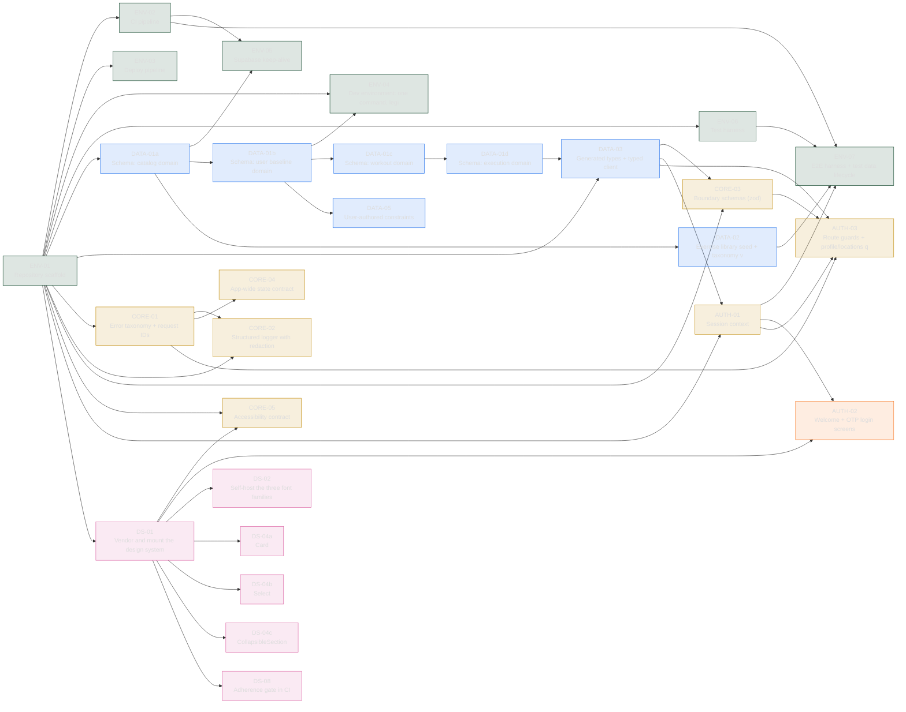
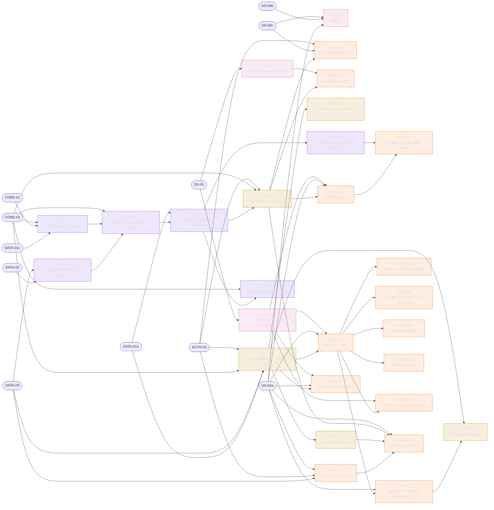
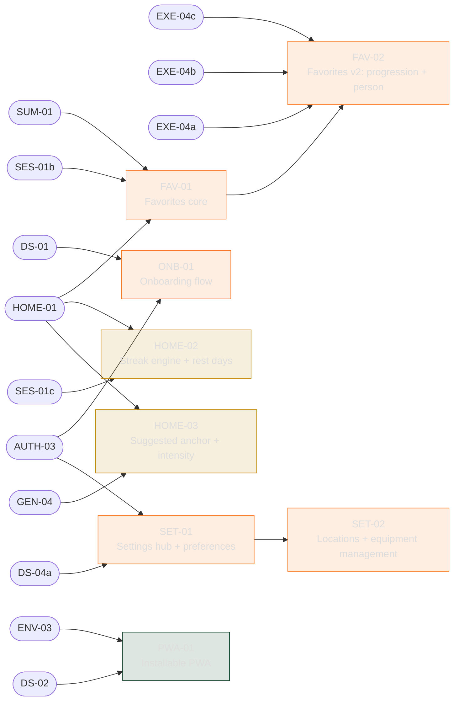

# DAG — the build order

**Generated** by `scripts/gen-dag.py` from `requirements/REQUIREMENTS.md`. Hand edits are meaningless; the next run overwrites them.

_Structural view — run with `--live` once issues exist to overlay open/closed._


| | |
|---|---|
| Requirements | **71** |
| Dependencies | **136** |
| Ready at t=0 | **ENV-01** |
| Critical path | **15 steps** |
| Widest parallelism | **13 issues at once** (wave 3) |


## Critical path

The longest chain in the graph. Nothing makes the build shorter than this, however many agents run in parallel — so a delay here is the only kind that costs calendar time.

`ENV-01 → DATA-01a → DATA-01b → DATA-01c → DATA-01d → DATA-03 → AUTH-01 → AUTH-03 → SES-01a → EXE-01 → EXE-02 → OVR-01a → OVR-01b → OVR-02 → OVR-04`


> **A longer critical path is not automatically worse.** Splitting `DATA-01` into four domain migrations added three steps to this chain, but those migrations were always sequential — foreign keys decide that, not the tickets. What the split bought is that `DATA-02` starts after `DATA-01a` instead of after all four. Count steps to find the chain that matters; do not treat the number as a score.


## Waves

What becomes available as the previous wave closes. This is not a schedule — it is the *shape* of the available parallelism.

| Wave | Count | Issues |
|---|---|---|
| 1 | 1 | ENV-01 |
| 2 | 6 | CORE-01, DATA-01a, DS-01, ENV-02, ENV-03, ENV-06 |
| 3 | 13 | CORE-02, CORE-04, CORE-05, DATA-01b, DATA-02, DS-02, DS-04a, DS-04b, DS-04c, DS-05, DS-06, DS-08, ENV-05 |
| 4 | 5 | DATA-01c, DATA-05, DS-07, ENV-04, PWA-01 |
| 5 | 1 | DATA-01d |
| 6 | 1 | DATA-03 |
| 7 | 3 | AUTH-01, CORE-03, GEN-02a |
| 8 | 4 | AUTH-02, AUTH-03, ENV-07, GEN-01 |
| 9 | 5 | GEN-02b, HIST-01, ONB-01, SES-01a, SET-01 |
| 10 | 6 | EXE-01, GEN-02c, SES-01b, SES-01c, SET-02, SUM-01 |
| 11 | 9 | EXE-02, EXE-03, EXE-04a, EXE-04b, EXE-04c, EXE-05, GEN-03, GEN-06, REV-02 |
| 12 | 7 | EXE-06, EXE-07, GEN-04, GEN-05, HOME-01, OVR-01a, REV-01 |
| 13 | 5 | FAV-01, HOME-02, HOME-03, OVR-01b, REV-03 |
| 14 | 4 | FAV-02, OVR-01c, OVR-02, OVR-03 |
| 15 | 1 | OVR-04 |


## Highest leverage

When several issues are ready, the one unblocking the most is usually the one to take.

| Issue | Unblocks |
|---|---|
| **ENV-01** — Repository scaffold | 12 |
| **DS-01** — Vendor and mount the design system | 10 |
| **DS-04a** — Card | 8 |
| **EXE-01** — Workout shell | 7 |
| **DATA-03** — Generated types + typed client | 6 |
| **CORE-03** — Boundary schemas (zod) | 6 |
| **AUTH-03** — Route guards + profile/locations queries | 6 |
| **SES-01a** — Session lifecycle + atomic persistence | 5 |


## M0 — 28 issues

Rounded nodes are dependencies from an earlier milestone.




## M1 — 28 issues

Rounded nodes are dependencies from an earlier milestone.




## M2 — 8 issues

Rounded nodes are dependencies from an earlier milestone.




## M3 — 7 issues

Rounded nodes are dependencies from an earlier milestone.

```mermaid
graph LR
  SES_01b(["SES-01b"])
  REV_02(["REV-02"])
  REV_01(["REV-01"])
  GEN_04(["GEN-04"])
  GEN_02b(["GEN-02b"])
  EXE_04c(["EXE-04c"])
  EXE_04b(["EXE-04b"])
  EXE_04a(["EXE-04a"])
  EXE_02(["EXE-02"])
  EXE_01(["EXE-01"])
  DS_05(["DS-05"])
  OVR_01a["OVR-01a<br/>Load anchors"]
  OVR_01b["OVR-01b<br/>Progression rules"]
  OVR_01c["OVR-01c<br/>Review surface: suggestion + "why "]
  OVR_02["OVR-02<br/>Generation integration (prompt bum"]
  OVR_03["OVR-03<br/>Timed-format progression"]
  OVR_04["OVR-04<br/>Deload detection + override"]
  EXE_06["EXE-06<br/>Mid-workout exercise swap"]
  EXE_02 --> OVR_01a
  SES_01b --> OVR_01a
  OVR_01a --> OVR_01b
  OVR_01b --> OVR_01c
  REV_01 --> OVR_01c
  DS_05 --> OVR_01c
  OVR_01b --> OVR_02
  GEN_02b --> OVR_02
  OVR_01b --> OVR_03
  EXE_04a --> OVR_03
  EXE_04b --> OVR_03
  EXE_04c --> OVR_03
  OVR_01a --> OVR_04
  OVR_02 --> OVR_04
  GEN_04 --> OVR_04
  EXE_01 --> EXE_06
  REV_02 --> EXE_06
  classDef state fill:#BF870022,stroke:#BF8700,color:#ddd
  class OVR_01a,OVR_01b,OVR_04 state
  classDef ui fill:#F8782322,stroke:#F87823,color:#ddd
  class OVR_01c,OVR_03,EXE_06 ui
  classDef api fill:#8250DF22,stroke:#8250DF,color:#ddd
  class OVR_02 api
```
