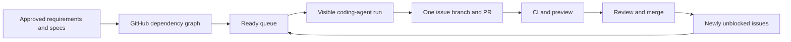
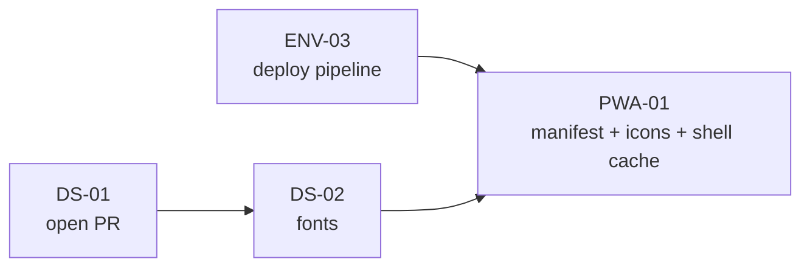
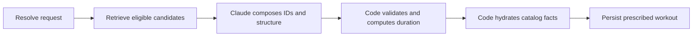

# CLEAR reconciled implementation plan

**Snapshot:** 2026-08-29 12:26 CDT  
**Repository:** <https://github.com/theycallme-eric/clear>  
**Scope:** approved v0.7 product requirements plus the minimum process needed to execute them

This is the review map, not a second backlog. GitHub Issues are the live source of work status and
dependency truth. `docs/requirements/REQUIREMENTS.md` is the frozen 71-requirement baseline;
`docs/DAG.md` is its generated structural graph. This document explains how those pieces become the
app and records the current snapshot in language a person can review.

## 1. One-page state of the build

| State | Product issues | Meaning |
|---|---:|---|
| Merged | 2 | ENV-01 repository shell and ENV-02 protected CI |
| Implemented in an open PR | 2 | DS-01 is red on one policy conflict; CORE-01 is green |
| Ready with no open PR | 3 | DATA-01a, ENV-03, and ENV-06 can start now |
| Blocked by dependencies | 64 | They become ready automatically as prerequisite issues merge |
| **Total approved product requirements** | **71** | 28 M0 · 28 M1 · 8 M2 · 7 M3 |

Post-baseline process work is tracked separately: OPS-01 (the DAG runner) is merged; OPS-02 (this
reconciliation) is documentation work and does not change the 71-node product graph.

### What exists today

- A public GitHub repository with the complete requirements history, 71 live product issues, 136
  dependency edges, four milestones, required CI checks, and protected `main`.
- A small React 19 + TypeScript + Vite application on `main`: one shell route, a 404 route, and basic
  unit tests. It is real code, but not yet a usable workout product.
- Vercel is already producing successful pull-request previews. ENV-03 still has to verify production
  deployment, SPA deep-link rewrites, and the environment-variable contract.
- PR [#76](https://github.com/theycallme-eric/clear/pull/76) vendors and mounts the approved design
  system. Typecheck, tests, build, and Vercel pass; Lint is red because CI scans immutable vendor
  logging as app-owned logging.
- PR [#77](https://github.com/theycallme-eric/clear/pull/77) adds typed errors and request IDs. Every
  required check is green.
- The approved generation contract, prompt, data model, worked example, information architecture,
  and screen/design references are in the repository and are sufficient to guide implementation.

### What does not exist today

- No new Supabase project is connected, no migrations have run against it, and no browser Supabase
  client exists.
- No authentication, exercise catalog, generation edge function, Anthropic call, workout screens,
  session persistence, history, manifest, or service worker exists in runtime code.
- No coding agent is currently running. The DAG runner selects and instructs work; it is not a
  resident worker.
- Claude Code is installed. No `fable` executable, Fable repository configuration, or verified Fable
  integration was found. The repository currently exposes explicit entry points for Claude Code and
  Codex.

### Current blocker and recommended resolution

DS-01 requires a byte-identical copy under `src/design-system/`; ENV-02 rejects `console.*` anywhere
under `src/`. The versioned export contains its own logging. The recommendation recorded on
[issue #23](https://github.com/theycallme-eric/clear/issues/23#issuecomment-5463775781) is to exclude
only `src/design-system/**` from the raw-console scan while retaining the rule for all CLEAR-owned
source. This awaits Eric's approval; it has not been changed silently.

## 2. The mental model



There are only four operational concepts:

1. **GitHub Issues say what to build.** Each issue has the approved acceptance checklist.
2. **The DAG says what can start.** It is a dependency filter, not another project and not an agent.
3. **A coding agent does one ready issue on one branch and opens one PR.** It does not merge by
   default.
4. **A merge advances the graph.** Until a parent PR merges, its dependent issues remain blocked.

Local files, GitHub, and an agent are separate:

- The Mac holds the working copy and any uncommitted edits.
- GitHub holds pushed commits, issues, pull requests, CI results, and the approved `main` history.
- Claude Code, Codex, or another compatible worker operates on the Mac. It is running only when a
  visible process has actually been launched.

## 3. What “PWA” means here

There are two useful definitions, and confusing them made the distance hard to understand.

### Installable shell

The shortest technical path is:



From the current snapshot, that means resolving and merging DS-01, implementing DS-02 and ENV-03,
then implementing PWA-01. The result can be added to an iPhone home screen and can cache its shell,
but it would still contain almost none of the workout product.

PWA-01 is labeled M2 because installability is not the product milestone. The graph technically
allows it once ENV-03 and DS-02 merge. If early installability is the priority, Eric can explicitly
select it when it becomes ready even while lower-milestone work remains.

### Useful PWA

A useful PWA requires the M1 gate: on a phone, Eric can authenticate, generate a real workout,
review it, execute every structure, log work durably, complete it, and see it in history. That path
depends on the backend, catalog, auth, generation, session, and execution tracks below.

Offline generation and offline database sync are intentionally not planned. PWA-01 caches only the
application shell; API responses are never cached. Durable set logging handles a dropped signal
without pretending the entire app is offline-capable.

## 4. Reconciled implementation sequence

The DAG remains authoritative at issue level. These phases are the human-readable grouping of the
same work, not new dependencies.

### Phase A — stabilize the two active product PRs

1. Eric decides whether to approve the narrow vendor exclusion for the raw-console scan.
2. Apply the approved correction to PR #76, rerun every check, and merge DS-01 only when green.
3. Review and merge green PR #77 for CORE-01.
4. Synchronize local `main` and rerun the ready queue. No user report-back should be necessary if an
   agent is explicitly monitoring those merges.

Outcome: the design substrate and shared error vocabulary are both on `main`, releasing 14 direct
dependent edges between them.

### Phase B — finish the M0 foundation in parallel lanes

| Lane | Ordered work | Outcome | Human gate |
|---|---|---|---|
| Data spine | DATA-01a → DATA-01b → DATA-01c → DATA-01d → DATA-03 | New schema, generated types, typed client | Create/link the new Supabase project |
| Catalog | DATA-01a → DATA-02 | Sanitized exercise/reference seed with taxonomy proof | Read old live catalog to reconcile 140 vs 173 rows |
| Design | DS-01 → DS-02 + DS-04a/b/c + DS-08 | Fonts, three missing wrappers, enforceable design rules | Approve DS-01 conflict first |
| Reliability | CORE-01 → CORE-02 + CORE-04; DS-01 → CORE-05 | Safe logs, four-state UI contract, accessibility harness | None expected |
| Infrastructure | ENV-03 + ENV-06; then ENV-04/05/07 as their data/auth prerequisites land | Deploys, component tests, legible dev startup, keep-alive, E2E | Vercel/Supabase authorization and test secret |
| Authentication | DATA-03 → AUTH-01 → AUTH-02/AUTH-03 | OTP login, minimal session context, guarded routes and independent profile/location queries | Supabase auth URLs/email flow may need dashboard confirmation |

The data spine is the critical path and DATA-01a is the live runner's current recommendation. ENV-03
and ENV-06 are independent and can be built alongside it. After DS-01 and CORE-01 merge, their newly
released children form another safe parallel batch.

M0 is complete only when a fresh clone starts cleanly, CI protects merges, `main` deploys, the new
Supabase project is fully migrated and seeded, auth works on the deployed URL, and the core design
substrate is integrated. A preview URL alone does not complete M0.

### Phase C — build the deterministic generation backbone

The generation pipeline is intentionally split so the model has one bounded job:



Implementation order:

1. CORE-03 adds Zod schemas at every boundary after DATA-03 exists.
2. GEN-02a resolves user constraints and retrieves per-section candidate sets after DATA-02 and
   DATA-03.
3. GEN-01 creates the authenticated, redacted, typed edge-function envelope after DATA-01c,
   CORE-01, and CORE-03.
4. GEN-02b assembles prompt v5/contract 4.1, calls Claude, records model/token/version metadata, and
   retries once on a typed correction. This is when the Anthropic key is needed.
5. GEN-02c validates, hydrates, and atomically persists after GEN-02b and DATA-01d.
6. GEN-06 independently checks duration plausibility. Claude's self-reported duration remains only a
   diagnostic.
7. GEN-03 exposes pending, success, typed error, retry, and cancellation state to the React app.

Code—not Claude—owns exercise eligibility, equipment availability, constraints, factual catalog
content, schema validity, duration checks, and persistence. Claude selects from allowed candidates
and composes the workout structure. There is no mock-workout fallback: a failed generation remains a
visible typed failure with a request ID.

### Phase D — deliver the M1 phone loop

Once generation and authentication exist, build the user path in dependency order:

1. GEN-04 and GEN-05: the generation form and honest loading/progress state.
2. REV-01, REV-02, and REV-03: review, section/exercise replacement, lineage, history, and undo.
3. SES-01a/b/c: atomic session lifecycle, prescribed/revised/performed reconstruction, and derived
   streaks.
4. EXE-01: the focused workout shell.
5. EXE-02, EXE-03, EXE-04a/b/c, and EXE-05: every workout structure, set logging, timers, rest, and
   coaching.
6. EXE-07: durable set logging that survives a dead signal without falsely marking unsaved work as
   saved.
7. SUM-01, HIST-01, and HOME-01: completion, history/detail, resume, recent workouts, and the daily
   entry point.
8. DS-05/06/07 support error surfaces, atmosphere, and rendered visual review throughout this phase.

M1 is complete only after a real workout can be performed end-to-end on a phone and the D6 swap
lineage regression test passes. A collection of individually rendered screens is not the M1 gate.

### Phase E — reach parity and installability (M2)

- ONB-01: first-run onboarding into profile, locations, equipment, preferences, and limitations.
- SET-01/02: all onboarding choices remain editable; location/equipment CRUD feeds generation.
- HOME-02/03: complete streak/rest logic and suggested focus/intensity.
- FAV-01/02: favorite snapshots, repeats, personal bests, and comparisons.
- PWA-01: manifest, icons, theme/iOS metadata, installability validation, and shell-only service
  worker.

M2 retires the old app. The explicit data decision is to start personal history fresh; parity means
feature capability, not copying prior user rows.

### Phase F — progressive training and in-workout adaptation (M3)

1. OVR-01a learns load anchors from valid working-set history.
2. OVR-01b applies pure, fully tested RPE/progression/confidence rules.
3. OVR-01c explains suggested weight on Review and permits a session-only override.
4. OVR-02 injects compact training history into generation; code still performs all arithmetic.
5. OVR-03 adds like-for-like timed-workout comparisons and density guidance.
6. OVR-04 detects deload conditions but never changes a workout without consent.
7. EXE-06 applies the established replacement lineage during an active workout.

## 5. Backend and data decision

The rebuild uses a **new Supabase backend**, not the old app's user database in place.

Reuse from the old project is limited to non-personal catalog/reference data:

- exercise IDs, names, equipment options, section eligibility, and primary-lift eligibility;
- coaching cues, regressions/progressions, component movements, roles, muscles, and pattern anchors;
- taxonomy inputs needed to prove the new generated classification is equivalent.

Do not copy auth users, profiles, locations, preferences, generated/completed workouts, set logs,
streaks, history, favorites, tokens, contact data, or any other personal activity.

Committed old migrations reconstruct 140 final exercises. DATA-02 expects 173 from the old live
catalog. That 33-row difference is a named gate: export only the live catalog, sanitize it, reconcile
the difference, and keep the acceptance count unless Eric deliberately amends the live issue.

## 6. Accounts, authorizations, and key timing

No API key is required to continue documentation, design integration, CI, component work, local
schema files, or most test work. Keys enter only at their owning issue.

| Earliest issue | External action | Destination | Exposure rule |
|---|---|---|---|
| ENV-03 | Audit/confirm the already-connected Vercel project and production deployment | Vercel project settings/CLI | No token in repository or chat |
| DATA-01a | Create or link the new Supabase project when migrations need a real target | Supabase project/CLI | Login remains in Supabase's auth mechanism |
| DATA-02 | Permit read-only access to the old live catalog | Old Supabase project | Export catalog tables only; no user rows |
| DATA-03 | Supply new project URL and public anon key | Gitignored local env + Vercel env values | Anon key may ship to browser; never service role |
| ENV-07 | Store test lifecycle/service-role credential | GitHub/Vercel/Supabase secret store as designed | Never browser code, chat, journal, or logs |
| AUTH-02/03 | Confirm deployed OTP redirect URLs and auth behavior | Supabase Auth dashboard | No email contents or codes recorded |
| GEN-02b | Store `ANTHROPIC_API_KEY` | Supabase Edge Function secrets | Never client-side, Vercel browser bundle, chat, or Git |

The agent should complete all safe local work before pausing and tell Eric the exact service screen
and variable name. Eric should enter values directly into the named secret store, never paste them
into a conversation.

## 7. How much can run unattended

### Review-gated runway — current policy

An agent can take every currently ready, unclaimed issue one at a time, test it, push it, and open a
PR. It can continue to other independent ready issues. It cannot start a dependent until its parent
PR merges. With no one merging overnight, it eventually exhausts the current frontier and stops.

At this snapshot, after the two active PRs are stabilized, the independent frontier includes at
least DATA-01a, ENV-03, and ENV-06. Merging DS-01 and CORE-01 releases more independent work.

### Protected auto-merge — optional future policy

If Eric explicitly authorizes protected auto-merge, a green PR can merge and release dependent work
without a return-to-chat handoff. That enables a longer continuous traversal but gives less time for
human product review. It should not be enabled implicitly, and UI/fitness-judgment or external-data
gates may still require review even under such a policy.

### Required launch record

Every unattended launch must record:

- tool/vendor and exact model;
- visible interactive session versus hidden/headless mode;
- selected runner mode and starting issue;
- allowed tools and external-write authority;
- merge policy;
- how progress, CI failures, and stop gates will be surfaced.

For the next run, use a user-visible interactive terminal by default. The prior hidden Claude run was
not attachable and made supervision needlessly opaque.

## 8. Known discrepancies and decisions to reconcile

These are not reasons to redesign the project. They are named so an agent does not guess.

1. **DS-01 vs ENV-02:** byte-identical vendor source conflicts with blanket raw-console scanning.
   Recommended decision is the narrow vendor exclusion described above.
2. **Catalog count:** committed old migrations yield 140 final exercises; DATA-02 expects 173 live
   exercises. Old live catalog access is required to reconcile, not to start the schema.
3. **Vercel state:** previews already deploy successfully although ENV-03 is open. ENV-03 should
   audit and complete production/deep-link/env behavior, not create a duplicate project blindly.
4. **Stale `docs/STATUS.md`:** it still says the repo is private and issue migration is pending. This
   OPS-02 work converts it into a pointer to this plan and the live queue.
5. **Generation spec labels:** `GENERATION_CONTRACT.md` contains duplicate proposal-status lines while
   `PROMPT_v4.md` calls itself implementation-ready. Before GEN-01/02 begins, the issue/spec owners
   should normalize status wording without changing the approved contract silently.
6. **Frozen-source duplicates:** ENV-03 repeats its dependency line and OVR-01c repeats one acceptance
   bullet. They do not change the generated graph or meaning, but should be corrected only through a
   deliberate baseline-maintenance decision because GitHub is now live truth.
7. **Fable:** the desired Fable “button” is not currently installed or configured in this repository.
   The current executable worker is Claude Code; Codex instructions also exist. Fable needs a
   concrete tool/integration identified before it can be treated as a runnable worker.
8. **Monitoring:** a session that is idle is not watching GitHub. Monitoring must be an explicit
   running action or the handoff must state that Eric needs to resume the session.

## 9. Complete product-issue inventory

Statuses are a snapshot. Dependencies are the approved prerequisites; GitHub remains authoritative
for whether they are open or closed.

### M0 — foundation (28)

| Issue | Outcome | Depends on | Snapshot status |
|---|---|---|---|
| [ENV-01 #1](https://github.com/theycallme-eric/clear/issues/1) | Repository scaffold | — | Merged via PR #72 |
| [ENV-02 #2](https://github.com/theycallme-eric/clear/issues/2) | Protected CI pipeline | ENV-01 | Merged via PR #75 |
| [ENV-03 #3](https://github.com/theycallme-eric/clear/issues/3) | Vercel deploy pipeline | ENV-01 | Ready now |
| [ENV-04 #4](https://github.com/theycallme-eric/clear/issues/4) | One-command hosted dev environment | ENV-01, DATA-01b | Blocked |
| [ENV-05 #5](https://github.com/theycallme-eric/clear/issues/5) | Supabase keep-alive | ENV-02, DATA-01a | Blocked |
| [ENV-06 #6](https://github.com/theycallme-eric/clear/issues/6) | Component-test harness | ENV-01 | Ready now |
| [ENV-07 #7](https://github.com/theycallme-eric/clear/issues/7) | Mobile E2E and test-data lifecycle | ENV-06, ENV-02, DATA-02, AUTH-01 | Blocked |
| [DATA-01a #8](https://github.com/theycallme-eric/clear/issues/8) | Catalog schema | ENV-01 | Ready; current recommendation |
| [DATA-01b #9](https://github.com/theycallme-eric/clear/issues/9) | User baseline schema | DATA-01a | Blocked |
| [DATA-01c #10](https://github.com/theycallme-eric/clear/issues/10) | Workout prescription schema | DATA-01b | Blocked |
| [DATA-01d #11](https://github.com/theycallme-eric/clear/issues/11) | Execution/set-log schema | DATA-01c | Blocked |
| [DATA-02 #12](https://github.com/theycallme-eric/clear/issues/12) | Exercise seed and taxonomy proof | DATA-01a | Blocked |
| [DATA-03 #13](https://github.com/theycallme-eric/clear/issues/13) | Generated types and typed client | ENV-01, DATA-01d | Blocked |
| [DATA-05 #14](https://github.com/theycallme-eric/clear/issues/14) | User-authored constraints | DATA-01b | Blocked |
| [CORE-01 #15](https://github.com/theycallme-eric/clear/issues/15) | Error taxonomy and request IDs | ENV-01 | PR #77 open; green |
| [CORE-02 #16](https://github.com/theycallme-eric/clear/issues/16) | Structured logger and redaction | ENV-01, CORE-01 | Blocked |
| [CORE-03 #17](https://github.com/theycallme-eric/clear/issues/17) | Zod boundary schemas | ENV-01, DATA-03 | Blocked |
| [CORE-04 #18](https://github.com/theycallme-eric/clear/issues/18) | Four-state app contract | CORE-01 | Blocked |
| [CORE-05 #19](https://github.com/theycallme-eric/clear/issues/19) | Cross-screen accessibility contract | ENV-01, DS-01 | Blocked |
| [AUTH-01 #20](https://github.com/theycallme-eric/clear/issues/20) | Minimal auth session context | ENV-01, DATA-03 | Blocked |
| [AUTH-02 #21](https://github.com/theycallme-eric/clear/issues/21) | Welcome and OTP screens | AUTH-01, DS-01 | Blocked |
| [AUTH-03 #22](https://github.com/theycallme-eric/clear/issues/22) | Guards and profile/location queries | AUTH-01, DATA-03, CORE-01, CORE-03 | Blocked |
| [DS-01 #23](https://github.com/theycallme-eric/clear/issues/23) | Vendor and mount design system | ENV-01 | PR #76 open; Lint red |
| [DS-02 #24](https://github.com/theycallme-eric/clear/issues/24) | Self-host three font families | DS-01 | Blocked |
| [DS-04a #25](https://github.com/theycallme-eric/clear/issues/25) | Card wrapper | DS-01 | Blocked |
| [DS-04b #26](https://github.com/theycallme-eric/clear/issues/26) | Select control | DS-01 | Blocked |
| [DS-04c #27](https://github.com/theycallme-eric/clear/issues/27) | CollapsibleSection control | DS-01 | Blocked |
| [DS-08 #31](https://github.com/theycallme-eric/clear/issues/31) | Design-adherence CI gate | DS-01 | Blocked |

### M1 — complete phone workout loop (28)

| Issue | Outcome | Depends on | Snapshot status |
|---|---|---|---|
| [DS-05 #28](https://github.com/theycallme-eric/clear/issues/28) | Toast host and error surfaces | DS-01 | Blocked |
| [DS-06 #29](https://github.com/theycallme-eric/clear/issues/29) | Atmosphere assignment | DS-01 | Blocked |
| [DS-07 #30](https://github.com/theycallme-eric/clear/issues/30) | Rendered design gallery | DS-04a/b/c | Blocked |
| [GEN-01 #32](https://github.com/theycallme-eric/clear/issues/32) | Edge-function envelope | DATA-01c, CORE-01, CORE-03 | Blocked |
| [GEN-02a #33](https://github.com/theycallme-eric/clear/issues/33) | Candidate resolution and retrieval | DATA-02, DATA-03 | Blocked |
| [GEN-02b #34](https://github.com/theycallme-eric/clear/issues/34) | Prompt composition and Claude call | GEN-02a, GEN-01, CORE-03 | Blocked |
| [GEN-02c #35](https://github.com/theycallme-eric/clear/issues/35) | Validation, hydration, persistence | GEN-02b, DATA-01d | Blocked |
| [GEN-03 #36](https://github.com/theycallme-eric/clear/issues/36) | Generation client state | GEN-02c, CORE-03, AUTH-03 | Blocked |
| [GEN-04 #37](https://github.com/theycallme-eric/clear/issues/37) | Generation screen | GEN-03, DS-04c, AUTH-03 | Blocked |
| [GEN-05 #38](https://github.com/theycallme-eric/clear/issues/38) | Loading screen | GEN-03, DS-06 | Blocked |
| [GEN-06 #39](https://github.com/theycallme-eric/clear/issues/39) | Independent duration plausibility | GEN-02c, CORE-03 | Blocked |
| [SES-01a #40](https://github.com/theycallme-eric/clear/issues/40) | Atomic session lifecycle | DATA-01d, DATA-03, CORE-03, AUTH-03 | Blocked |
| [SES-01b #41](https://github.com/theycallme-eric/clear/issues/41) | Three-state reconstruction and D6 regression | SES-01a | Blocked |
| [SES-01c #42](https://github.com/theycallme-eric/clear/issues/42) | Derived streak | SES-01a | Blocked |
| [REV-01 #43](https://github.com/theycallme-eric/clear/issues/43) | Review screen | GEN-03, DS-04a, DS-05 | Blocked |
| [REV-02 #44](https://github.com/theycallme-eric/clear/issues/44) | Section/exercise swap function | GEN-02c | Blocked |
| [REV-03 #45](https://github.com/theycallme-eric/clear/issues/45) | Swap history, undo, and nudge UI | REV-01, REV-02 | Blocked |
| [EXE-01 #46](https://github.com/theycallme-eric/clear/issues/46) | Workout shell | SES-01a, DS-04a, DS-05 | Blocked |
| [EXE-02 #47](https://github.com/theycallme-eric/clear/issues/47) | Standard/superset rendering and set logs | EXE-01, DS-04a | Blocked |
| [EXE-03 #48](https://github.com/theycallme-eric/clear/issues/48) | Circuit and EMOM rendering | EXE-01 | Blocked |
| [EXE-04a #49](https://github.com/theycallme-eric/clear/issues/49) | Ladder rendering | EXE-01 | Blocked |
| [EXE-04b #50](https://github.com/theycallme-eric/clear/issues/50) | For Time rendering | EXE-01 | Blocked |
| [EXE-04c #51](https://github.com/theycallme-eric/clear/issues/51) | AMRAP rendering | EXE-01 | Blocked |
| [EXE-05 #52](https://github.com/theycallme-eric/clear/issues/52) | Rest timer and coaching panel | EXE-01, DS-05 | Blocked |
| [EXE-07 #53](https://github.com/theycallme-eric/clear/issues/53) | Durable set logging | EXE-02, SES-01a | Blocked |
| [SUM-01 #54](https://github.com/theycallme-eric/clear/issues/54) | Post-workout summary | SES-01a, DS-04a, DS-05 | Blocked |
| [HIST-01 #55](https://github.com/theycallme-eric/clear/issues/55) | History list and detail | DATA-03, AUTH-03, DS-04a | Blocked |
| [HOME-01 #56](https://github.com/theycallme-eric/clear/issues/56) | Home screen v1 | HIST-01, SES-01c, GEN-03, DS-04a | Blocked |

### M2 — parity and installability (8)

| Issue | Outcome | Depends on | Snapshot status |
|---|---|---|---|
| [ONB-01 #57](https://github.com/theycallme-eric/clear/issues/57) | First-run onboarding | AUTH-03, DS-01 | Blocked |
| [FAV-01 #58](https://github.com/theycallme-eric/clear/issues/58) | Favorite workout snapshots | SUM-01, SES-01b, HOME-01 | Blocked |
| [FAV-02 #59](https://github.com/theycallme-eric/clear/issues/59) | Favorite progression and personal bests | FAV-01, EXE-04a/b/c | Blocked |
| [HOME-02 #60](https://github.com/theycallme-eric/clear/issues/60) | Full streak/rest-day engine | HOME-01, SES-01c | Blocked |
| [HOME-03 #61](https://github.com/theycallme-eric/clear/issues/61) | Suggested focus and intensity | HOME-01, GEN-04 | Blocked |
| [SET-01 #62](https://github.com/theycallme-eric/clear/issues/62) | Settings and preferences | AUTH-03, DS-04a | Blocked |
| [SET-02 #63](https://github.com/theycallme-eric/clear/issues/63) | Location/equipment management | SET-01 | Blocked |
| [PWA-01 #64](https://github.com/theycallme-eric/clear/issues/64) | Installable shell-only PWA | ENV-03, DS-02 | Blocked |

### M3 — progression and adaptation (7)

| Issue | Outcome | Depends on | Snapshot status |
|---|---|---|---|
| [OVR-01a #65](https://github.com/theycallme-eric/clear/issues/65) | Load anchors | EXE-02, SES-01b | Blocked |
| [OVR-01b #66](https://github.com/theycallme-eric/clear/issues/66) | Progression rules | OVR-01a | Blocked |
| [OVR-01c #67](https://github.com/theycallme-eric/clear/issues/67) | Suggested-weight explanation and override | OVR-01b, REV-01, DS-05 | Blocked |
| [OVR-02 #68](https://github.com/theycallme-eric/clear/issues/68) | Training-history generation integration | OVR-01b, GEN-02b | Blocked |
| [OVR-03 #69](https://github.com/theycallme-eric/clear/issues/69) | Timed-format progression | OVR-01b, EXE-04a/b/c | Blocked |
| [OVR-04 #70](https://github.com/theycallme-eric/clear/issues/70) | Deload detection and consent | OVR-01a, OVR-02, GEN-04 | Blocked |
| [EXE-06 #71](https://github.com/theycallme-eric/clear/issues/71) | Mid-workout exercise swap | EXE-01, REV-02 | Blocked |

## 10. Recommended return checklist

Review these in order; each decision has a default recommendation.

1. **DS-01 policy conflict:** approve excluding the immutable `src/design-system/**` subtree from
   the raw-console grep. Recommended: approve.
2. **CORE-01 PR #77:** review the green error-taxonomy PR and merge if the implementation reads
   correctly. Recommended: merge.
3. **DS-01 PR #76:** after the approved fix and a monitored green CI run, review and merge.
4. **Next work frontier:** start DATA-01a first, with ENV-03 and ENV-06 safe in parallel.
5. **Supabase:** create/link a new project when DATA-01a reaches the real-project gate. Do not reuse
   old user tables. No Anthropic key is needed yet.
6. **Agent mode:** use a visible Claude terminal. Recommended: keep manual merges for the next
   foundation batch, then decide whether protected auto-merge is worth the reduced supervision.
7. **PWA priority:** decide whether to take PWA-01 as soon as ENV-03 and DS-02 release it, knowing it
   will be an installable shell, or keep milestone-first ordering toward the useful M1 loop.
8. **Fable:** identify the specific Fable product/tool before expecting the repository runner to
   launch it; it is not currently connected.

## 11. Keeping this plan synchronized

At the start and end of a material work session:

```sh
git switch main
git pull --ff-only origin main
python3 scripts/dag-ready.py
python3 scripts/gen-issues.py --check
```

Then update only the snapshot sections of this document when the phase-level story changes. Do not
manually maintain issue open/closed status as a competing backlog; link to GitHub and use the live
ready command for execution. Update the complete inventory only when a requirement is deliberately
added, removed, renamed, or has its dependencies changed through the live issue process.

Every handoff reports exactly:

1. what exists;
2. what is actually running;
3. what is blocked and why;
4. the next action and who owns it.
