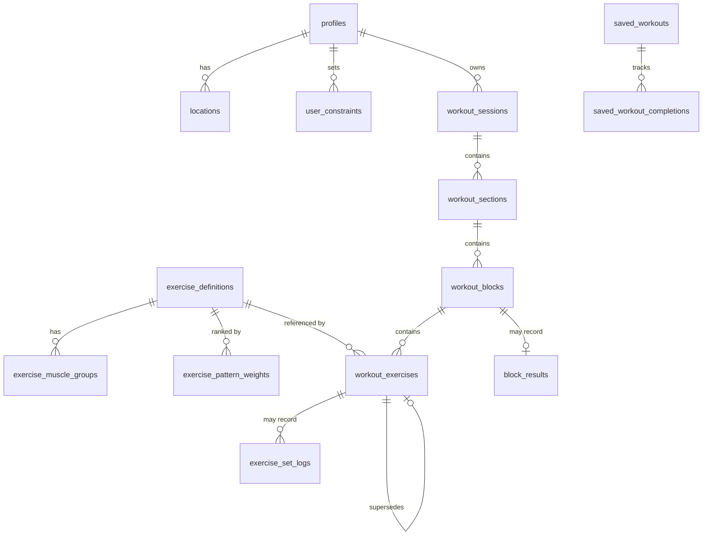
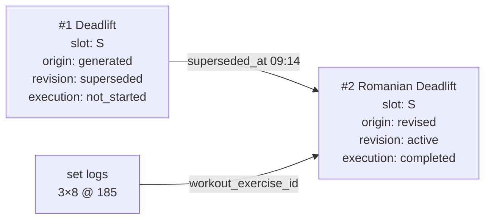

# CLEAR — Data Model

> **Status:** proposal, revision 2
> **Implements:** `CHANGE_SET_v0.4.md` rev 3
> **Revision 2:** first-class blocks · exercise targets separated from block rounds · temporal lineage with split statuses · complete performed-state reconstruction · time and distance execution · constraint persistence enforced · staged taxonomy migration preserving anchor ranking · unambiguous duration fields · snapshot versioning.
> **Target:** one Postgres database (Supabase). RLS on every user table.

---

## 1. What this has to demonstrate

| Obligation | Where |
|---|---|
| Reconstruct prescribed / revised / performed | §7 temporal lineage · §8 |
| Partial log without null meaning zero or skip | §8 |
| Preserve revisions and execution through regeneration | §7 |
| Execution attaches to the exercise actually performed | §7 |
| Duration computed independently of Claude | §6 · §9 |
| Deterministically exclude constrained exercises | §5 |
| Retain requested and effective inputs | §6 |
| Retain prompt and contract versions | §6 |
| One Postgres deployment | throughout |

---

## 2. Domains



**Catalog** — read-only to clients: `exercise_definitions`, `exercise_muscle_groups`, `exercise_pattern_weights`, `component_pattern_map`, `focus_pattern_map`.
**User baseline** — `profiles`, `locations`, `user_constraints`.
**Workout** — `workout_sessions`, `workout_sections`, `workout_blocks`, `workout_exercises`.
**Execution** — `exercise_set_logs`, `block_results`.

The new level is **blocks**, sitting between sections and exercises. §6 explains why.

---

## 3. Taxonomy — staged, with ranking preserved

### The finding

`exercise_definitions.component_movements` is populated across **142 exercises** with 20 values, and distinguishes `vertical-press` from `horizontal-press`, `vertical-pull` from `horizontal-pull` — more precise than the flat anchor enum. Patterns derive from it. **No re-tagging.**

### What derivation alone would lose

`exercise_anchors` carries `is_primary`. Derivation discards it, and that matters: push-press has both `vertical-press` and `triple-extension` in its components, so a pure derivation makes it *equally* a press and a power movement. Its authored anchor probably says power primary, press secondary.

**That ranking is real information and is preserved**, not by keeping a parallel system, but by making the anchor data a **weighting layer over derived patterns**.

```sql
-- Derived candidate patterns (no authoring)
CREATE VIEW exercise_patterns AS
SELECT DISTINCT ed.id AS exercise_id, m.movement_pattern
FROM exercise_definitions ed
CROSS JOIN LATERAL unnest(ed.component_movements) AS c(component)
JOIN component_pattern_map m ON m.component = c.component;

-- Authored ranking, migrated from exercise_anchors.
-- Only pattern-bearing anchors migrate; region anchors (upper_body, lower_body,
-- full_body) are focus values, not patterns, and are dropped deliberately.
CREATE TABLE exercise_pattern_weights (
  exercise_id      text REFERENCES exercise_definitions(id) ON DELETE CASCADE,
  movement_pattern movement_pattern NOT NULL,
  is_primary       boolean NOT NULL DEFAULT false,
  PRIMARY KEY (exercise_id, movement_pattern)
);

-- What candidate retrieval reads
CREATE VIEW exercise_pattern_ranked AS
SELECT ep.exercise_id, ep.movement_pattern,
       COALESCE(w.is_primary, false) AS is_primary
FROM exercise_patterns ep
LEFT JOIN exercise_pattern_weights w
  ON w.exercise_id = ep.exercise_id AND w.movement_pattern = ep.movement_pattern;
```

An exercise with no weighting row still appears as a candidate; it simply isn't marked primary. Coverage of the weighting table can be partial without breaking anything.

### Mapping tables

```sql
CREATE TABLE component_pattern_map (
  component        text PRIMARY KEY,
  movement_pattern movement_pattern NOT NULL
);
CREATE TABLE focus_pattern_map (
  session_focus    session_focus    NOT NULL,
  movement_pattern movement_pattern NOT NULL,
  PRIMARY KEY (session_focus, movement_pattern)
);
```

| Component | Count | Pattern |
|---|---|---|
| `knee-flexion` | 27 | squat |
| `hip-hinge` | 20 | hinge |
| `vertical-press` / `horizontal-press` | 18 / 13 | press |
| `triple-extension` | 17 | power |
| `horizontal-pull` / `vertical-pull` | 7 / 5 | pull |
| `single-leg-stability` | 11 | unilateral |
| `cardio-output` | 12 | conditioning |

Quality components — `brace` (61), `scapular-control`, `posterior-chain-activation`, `grip`, the mobility set, `anti-rotation`, `landing-mechanics`, `anti-lateral-flexion` — stay untouched for the warmup coverage rule. They describe demands, not patterns.

| focus | patterns |
|---|---|
| `upper_body` | press, pull |
| `lower_body` | squat, hinge, unilateral |
| `full_body` | squat, hinge, press, pull, unilateral |
| `power` | power |

### Migration is staged and separate

The taxonomy cascade is fourteen items and unrelated to D5 and D6. It is **its own migration**, verified before the old structures are dropped:

1. Create `component_pattern_map`, `focus_pattern_map`, the views.
2. Migrate pattern-bearing rows from `exercise_anchors` into `exercise_pattern_weights`.
3. **Compare** candidate sets and focus suggestions, derived versus original, across all four focuses.
4. Inspect false positives and any lost primary/secondary distinctions.
5. Drop `exercise_anchors` and `anchor_type` only after equivalence holds.

Step 3 is a real verification task, not a formality — it belongs in `DATA-02`'s acceptance criteria.

### Cascade

| # | Affected | Change |
|---|---|---|
| 1 | `workout_sessions.anchor` | → `session_focus` |
| 2 | `exercise_anchors` | → `exercise_pattern_weights` (ranking only), dropped after step 5 |
| 3 | `anchor_type` enum | → `session_focus` + `movement_pattern` |
| 4 | `suggest_anchor()` | → `suggest_session_focus()`, plus pattern-level staleness |
| 5 | `exercise_definitions_with_anchors` | → `exercise_catalog` |
| 6 | `exercises_with_context` | Regenerated |
| 7 | Generation prompt | *"Upper Body → Press OR Pull"* becomes a join |
| 8 | `filterByAnchor()` | → `focus_pattern_map` join + role-exempt roles |
| 9 | `HOME-03` | Pattern-level staleness available |
| 10 | Weekly coverage | Gains a pattern axis |
| 11 | Generation screen | **No visual change** |
| 12 | `saved_workouts.anchor` TEXT | → `session_focus` |
| 13 | Generated types | Regenerate |
| 14 | Prompt version | Bump |

---

## 4. Catalog

`exercise_definitions` carries forward unchanged in shape. `exercise_role` and `exercise_muscle_groups.role` become enums (§10).

```sql
CREATE VIEW exercise_catalog AS
SELECT ed.*,
  ARRAY(SELECT epr.movement_pattern FROM exercise_pattern_ranked epr
        WHERE epr.exercise_id = ed.id)                       AS movement_patterns,
  ARRAY(SELECT epr.movement_pattern FROM exercise_pattern_ranked epr
        WHERE epr.exercise_id = ed.id AND epr.is_primary)    AS primary_patterns,
  ARRAY(SELECT jsonb_build_object('muscle', emg.muscle_group, 'role', emg.role)
        FROM exercise_muscle_groups emg WHERE emg.exercise_id = ed.id) AS muscles
FROM exercise_definitions ed;
```

---

## 5. User baseline

### `profiles`

**Added:** `weight_unit weight_unit NOT NULL DEFAULT 'lb'` — the profile default. Set logs carry their own (§8).

**Dropped:** the six streak columns. Streak becomes a function over `workout_sessions`.

> **Decision flagged.** This is a greenfield schema, so "defer" would mean creating columns intended for deletion. Deriving from day one is cleaner — but `SES-01` (M1) currently *increments* a counter that would no longer exist, so its acceptance changes from "increments the streak" to "the streak function returns the correct value after completion." That moves a small amount of `HOME-02` work earlier. Called out rather than assumed.

**`mood`** becomes `smallint CHECK (mood BETWEEN 1 AND 5)`; it is `text` today for a 1–5 rating.

### `user_constraints` — `DATA-05`

```sql
CREATE TABLE user_constraints (
  id          uuid PRIMARY KEY DEFAULT gen_random_uuid(),
  user_id     uuid NOT NULL REFERENCES auth.users(id) ON DELETE CASCADE,
  scope       constraint_scope  NOT NULL,   -- exercise | movement_pattern | equipment
  action      constraint_action NOT NULL,   -- exclude | avoid | prefer_not
  persistence constraint_persistence NOT NULL DEFAULT 'persistent',
  applies_to_session_id uuid REFERENCES workout_sessions(id) ON DELETE CASCADE,

  target_exercise_id text REFERENCES exercise_definitions(id),
  target_pattern     movement_pattern,
  target_equipment   text,
  note        text,
  created_at  timestamptz NOT NULL DEFAULT now(),

  CONSTRAINT exactly_one_target CHECK (
    num_nonnulls(target_exercise_id, target_pattern, target_equipment) = 1),
  CONSTRAINT target_matches_scope CHECK (
    (scope = 'exercise'         AND target_exercise_id IS NOT NULL) OR
    (scope = 'movement_pattern' AND target_pattern     IS NOT NULL) OR
    (scope = 'equipment'        AND target_equipment   IS NOT NULL)),
  CONSTRAINT session_scope_has_session CHECK (
    persistence = 'persistent' OR applies_to_session_id IS NOT NULL)
);
```

**`applies_to_session_id` is the fix for a real leak.** Without it a one-session exclusion applies forever. Every eligibility query filters:

```sql
WHERE persistence = 'persistent'
   OR applies_to_session_id = $current_session
```

**`note` is never parsed.** Free text may reach Claude as best-effort composition context; a deterministic exclusion always comes from an explicit row.

**UI exposes `exclude` only, for now.** `avoid` and `prefer_not` are modelled and reach Claude as a deprioritize list, but nothing enforces them — offering a control that silently may not work is worse than not offering it. They surface when a ranking layer consumes them.

---

## 6. Workout — prescription

### `workout_sessions`

Duration gets four unambiguous fields, replacing one overloaded `duration_mins`:

```sql
requested_duration_mins       int NOT NULL,  -- what the user asked for
effective_duration_target_mins int NOT NULL, -- what generation targeted, after clamps
computed_duration_mins        int,           -- what GEN-06 calculated
actual_duration_mins          int,           -- what elapsed

requested_intensity int NOT NULL,
effective_intensity int NOT NULL,
adjustment_reason   text,

session_focus    session_focus NOT NULL,
prompt_version   text NOT NULL,
contract_version text NOT NULL,
```

Storing `computed_duration_mins` makes the diagnostic comparison against Claude's own estimate possible after the fact, which is how you learn whether the model understands what it composed.

### `workout_blocks` — new

**The normalization fix.** Structure attributes were on every member exercise, duplicated per member, with nothing preventing three exercises in one circuit from disagreeing about the timer.

```sql
CREATE TABLE workout_blocks (
  id            uuid PRIMARY KEY DEFAULT gen_random_uuid(),
  section_id    uuid NOT NULL REFERENCES workout_sections(id) ON DELETE CASCADE,
  order_index   int  NOT NULL,

  structure_type     structure_type NOT NULL,   -- standard|superset|circuit|emom|amrap|for_time
  rounds             int,                        -- fixed rounds; null when open-ended
  timer_type         timer_contract NOT NULL DEFAULT 'none',
  timer_seconds      int,                        -- duration or cap
  round_rest_seconds int,
  rep_scheme         rep_scheme NOT NULL DEFAULT 'fixed',
  block_notes        text,
  created_at timestamptz NOT NULL DEFAULT now(),

  CONSTRAINT timed_structures_have_a_clock CHECK (
    structure_type NOT IN ('emom','amrap','for_time') OR timer_seconds IS NOT NULL),
  CONSTRAINT fixed_round_structures_have_rounds CHECK (
    structure_type <> 'circuit' OR rounds IS NOT NULL),
  UNIQUE (section_id, order_index)
);
```

**Every exercise belongs to a block.** A `standard` block groups exercises performed independently in sequence — the ordinary accessory section is one standard block with four exercises. Non-standard blocks group exercises performed together per their structure.

This also fixes a defect inherited from the current schema: `structure_results` was keyed to `section_id`, so a conditioning section containing an EMOM *and* an AMRAP could only record one. Results now attach to blocks (§8).

### `workout_exercises`

```sql
CREATE TABLE workout_exercises (
  id          uuid PRIMARY KEY DEFAULT gen_random_uuid(),
  block_id    uuid NOT NULL REFERENCES workout_blocks(id) ON DELETE CASCADE,
  exercise_id text NOT NULL REFERENCES exercise_definitions(id),
  order_index int  NOT NULL,

  -- ── prescription: what THIS exercise asks for, per round or per set ──
  modality      prescription_modality NOT NULL,  -- reps | time | distance
  sets          int,                              -- null inside open-ended blocks
  target_kind   target_kind NOT NULL,             -- fixed | range | sequence
  target_value  int,          -- fixed
  target_min    int,          -- range
  target_max    int,          -- range
  target_sequence int[],      -- sequence: ordered ladder/pyramid rungs
  per_side      boolean NOT NULL DEFAULT false,
  distance_unit distance_unit,                    -- only when modality = 'distance'
  rest_seconds  int,                              -- between this exercise's sets
  tempo         text,                             -- display only

  load_type  load_guidance,   -- percent_1rm|rir|bodyweight|prior_session|absolute|none
  load_value numeric,

  equipment_used text NOT NULL,
  is_interval_exercise boolean NOT NULL DEFAULT false,

  -- ── lineage (I1) ──
  slot_id      uuid NOT NULL,       -- stable across revisions of the same slot
  replaces_id  uuid REFERENCES workout_exercises(id),
  origin       prescription_origin NOT NULL DEFAULT 'generated',
  created_at   timestamptz NOT NULL DEFAULT now(),
  superseded_at timestamptz,

  -- ── two independent statuses ──
  revision_status  revision_status  NOT NULL DEFAULT 'active',      -- active|superseded
  execution_status execution_status NOT NULL DEFAULT 'not_started', -- not_started|completed|skipped

  exercise_notes text,

  CONSTRAINT target_shape CHECK (
    (target_kind = 'fixed'    AND target_value IS NOT NULL
       AND target_min IS NULL AND target_max IS NULL AND target_sequence IS NULL) OR
    (target_kind = 'range'    AND target_min IS NOT NULL AND target_max IS NOT NULL
       AND target_max > target_min AND target_value IS NULL AND target_sequence IS NULL) OR
    (target_kind = 'sequence' AND target_sequence IS NOT NULL
       AND array_length(target_sequence,1) > 1
       AND target_value IS NULL AND target_min IS NULL AND target_max IS NULL)),
  CONSTRAINT distance_has_unit CHECK (
    modality <> 'distance' OR distance_unit IS NOT NULL),
  CONSTRAINT load_value_matches_type CHECK (
    load_type IN ('bodyweight','prior_session','none') OR load_value IS NOT NULL),
  CONSTRAINT superseded_has_timestamp CHECK (
    (revision_status = 'active' AND superseded_at IS NULL) OR
    (revision_status = 'superseded' AND superseded_at IS NOT NULL)),
  CONSTRAINT one_successor UNIQUE (replaces_id)   -- no branching lineage
);
```

**`rounds` is not a modality.** An exercise inside an AMRAP still prescribes reps or time *per round*; the block is what repeats. The earlier design made one field carry both meanings and produced the unanswerable "`work_targets` for rounds modality" question. It no longer exists.

**Targets are discriminated.** An integer array alone cannot distinguish `{8,10}` as a rep range from `{8,10}` as two ladder rungs. `target_kind` settles it, `per_side` handles unilateral prescriptions, and `distance_unit` handles distance. Modality determines whether the numbers mean reps, seconds, or distance.

**`reps_prescribed` on logs is gone.** Prescription rows are immutable under append-and-supersede, so a log joins back to the exact prescription it was performed against. The snapshot was redundant, and it never worked for time or distance anyway.

---

## 7. The three states — temporal lineage

**Mechanism: append and supersede, with timestamps.** No row is ever mutated into a different exercise.

A swap inserts a new `workout_exercises` row carrying the **same `slot_id`**, with `replaces_id` pointing back, `origin = 'revised'`. The old row gets `revision_status = 'superseded'` and `superseded_at = now()`. Its `execution_status` is untouched.



That arrow is D6. Today the logs point at row #1 — an exercise never performed.

### Why two statuses

Collapsing revision and execution into one column loses information: replacing an exercise the user already completed would overwrite `completed` with `replaced`. Separate columns mean a superseded row still records that it was performed — which matters if after-start regeneration is ever allowed.

### The three states as queries

| State | Query |
|---|---|
| **as generated** | `origin = 'generated'` |
| **as intended at start** | `created_at <= session.started_at AND (superseded_at IS NULL OR superseded_at > session.started_at)` |
| **as currently active** | `revision_status = 'active'` |
| **as performed** | §8 — a view, not a single join |

**Intended-at-start is temporal, not `revision_status = 'active'`.** Those diverge the moment a swap happens after the workout starts. Since after-start regeneration is an unresolved policy question, the schema must not assume the answer.

`slot_id` makes "what filled this slot over time" a single-column query rather than a recursive walk up `replaces_id`. `UNIQUE (replaces_id)` prevents two rows claiming the same predecessor.

**Why not whole-workout versioning:** it duplicates every unchanged row on every swap and makes "what did I do" a reconciliation problem instead of a filter.

---

## 8. Execution

### `exercise_set_logs`

Prescriptions support reps, time, and distance, so logs must too.

```sql
CREATE TABLE exercise_set_logs (
  id uuid PRIMARY KEY DEFAULT gen_random_uuid(),
  workout_exercise_id uuid NOT NULL REFERENCES workout_exercises(id) ON DELETE CASCADE,
  set_number int NOT NULL,

  actual_reps             int,
  actual_duration_seconds int,
  actual_distance         numeric,
  actual_distance_unit    distance_unit,
  weight                  numeric,
  weight_unit             weight_unit,
  rpe                     numeric(3,1),

  is_warmup_set boolean NOT NULL DEFAULT false,
  created_at timestamptz NOT NULL DEFAULT now(),

  UNIQUE (workout_exercise_id, set_number),
  CONSTRAINT weight_has_unit CHECK (weight IS NULL OR weight_unit IS NOT NULL),
  CONSTRAINT distance_has_unit CHECK (actual_distance IS NULL OR actual_distance_unit IS NOT NULL)
);
```

**Missing-data semantics (I3):**

- **A row exists** → the user engaged with this set.
- **A null value** → not recorded. Never zero, never a skip.
- **Zero** → a real result. `actual_reps = 0` is a failed attempt, distinguishable from `NULL`.
- **No row** → not recorded at that set number.
- **Skipped** → `workout_exercises.execution_status = 'skipped'`. A real observation, distinct from silence.

`weight_unit` is per row, not inherited. A profile default that changes must never silently reinterpret history — that is an injury path, not a display bug.

### `block_results` — replaces `structure_results`

```sql
CREATE TABLE block_results (
  id       uuid PRIMARY KEY DEFAULT gen_random_uuid(),
  block_id uuid NOT NULL UNIQUE REFERENCES workout_blocks(id) ON DELETE CASCADE,

  elapsed_seconds      int,      -- count-up / For Time
  completed_under_cap  boolean,  -- For Time
  rounds_completed     int,      -- AMRAP, circuit
  partial_round_reps   int,      -- AMRAP partial round
  minutes_completed    int,      -- EMOM
  highest_rung         int,      -- ladder: which rung was reached

  perceived_effort smallint CHECK (perceived_effort BETWEEN 1 AND 10),
  notes text,
  created_at timestamptz NOT NULL DEFAULT now()
);
```

Keyed to **block**, not section — a conditioning section with an EMOM and an AMRAP records both.

Timer contracts map onto specific fields: count-up and For Time write `elapsed_seconds` and `completed_under_cap`; countdown and AMRAP write `rounds_completed` and `partial_round_reps`; EMOM writes `minutes_completed`.

`perceived_effort` is retained because `EXE-04` specifies the UI captures section RPE at completion — the collection point exists in the spec, so this is not speculative storage.

### "As performed" — a view, not a join

Set logs alone miss skipped exercises, block outcomes, and completed exercises with partial fields.

```sql
CREATE VIEW session_performed AS
SELECT
  s.id AS session_id,
  wb.id AS block_id, wb.structure_type, wb.order_index AS block_order,
  we.id AS workout_exercise_id, we.slot_id, we.exercise_id,
  we.execution_status, we.origin,
  br.elapsed_seconds, br.rounds_completed, br.partial_round_reps,
  br.minutes_completed, br.highest_rung, br.perceived_effort,
  ARRAY(SELECT to_jsonb(l) FROM exercise_set_logs l
        WHERE l.workout_exercise_id = we.id ORDER BY l.set_number) AS set_logs
FROM workout_sessions s
JOIN workout_sections  ws ON ws.session_id = s.id
JOIN workout_blocks    wb ON wb.section_id = ws.id
JOIN workout_exercises we ON we.block_id  = wb.id AND we.revision_status = 'active'
LEFT JOIN block_results br ON br.block_id = wb.id;
```

Every active exercise appears, whether or not it has logs. A skipped exercise appears with `execution_status = 'skipped'` and an empty array — visible, not inferred from absence.

---

## 9. Duration plausibility — inputs

Everything `GEN-06` needs is present. Blocks make the algorithm read directly off the structure:

| Block type | Duration |
|---|---|
| `standard` | Σ over members: `sets × WORK_PER_SET + (sets − 1) × rest_seconds` |
| `superset` / `circuit` | `rounds × Σ(member work) + (rounds − 1) × round_rest_seconds` |
| `emom` / `amrap` / `for_time` | `timer_seconds` |

Plus a fixed transition allowance per exercise and per section. Constants live in the `GEN-06` module. **No metadata table, no per-exercise override, no tempo parsing.**

Shared rest is counted once per round because it lives on the block, which is the normalization fix doing real work.

---

## 10. Enums

**New:** `session_focus` · `movement_pattern` · `prescription_modality` (reps, time, distance) · `target_kind` (fixed, range, sequence) · `distance_unit` (m, km, ft, mi) · `timer_contract` · `load_guidance` · `prescription_origin` · `revision_status` (active, superseded) · `execution_status` (not_started, completed, skipped) · `constraint_scope` · `constraint_action` · `constraint_persistence` · `weight_unit` (lb, kg).

**Converted from TEXT:** `structure_type` · `rep_scheme` · `exercise_role` · `muscle_role`.

**Dropped:** `anchor_type` (after taxonomy verification).

---

## 11. Dropped, renamed, moved

| Was | Now | Why |
|---|---|---|
| `exercises` | `workout_exercises` | Holds prescribed instances, not exercises |
| `exercises.reps` TEXT | `modality` + discriminated targets | One column held four data types |
| structure fields on exercises | `workout_blocks` | Block attributes duplicated per member could disagree |
| `structure_results` (section-keyed) | `block_results` (block-keyed) | A section can hold multiple blocks |
| `exercises.weight_logged` TEXT | *dropped* | Superseded by set logs; free text that looked usable |
| `exercises.coaching_cues` TEXT | *dropped* | Hydrated from the catalog TEXT[] |
| `exercises.effort_percent` | `load_type` + `load_value` | Folded |
| `exercise_anchors` | `exercise_pattern_weights` | Ranking preserved; region tags dropped |
| `anchor_type` | `session_focus` + `movement_pattern` | Three concepts in one enum |
| `profiles` streak ×6 | *derived* | Stored derived state drifts |
| `workout_sessions.duration_mins` | four explicit fields | One name, four meanings |
| `workout_sessions.mood` TEXT | `smallint` 1–5 | It is a rating |
| `exercise_set_logs.reps_prescribed` | *dropped* | Redundant under immutable prescriptions; wrong for time/distance |

### `saved_workouts` — snapshot versioning

`workout_snapshot` is JSONB holding a workout in the shape of its era. Structured prescriptions change that shape, so every existing favorite becomes unrestorable and future ones break on the next contract change.

```sql
snapshot_contract_version text NOT NULL
```

`FAV-01` validates the snapshot against the schema for its stated version before restore, and surfaces a clear message when a favorite predates a breaking change rather than failing obscurely.

---

## 12. Requirement mapping

| Requirement | Section |
|---|---|
| `DATA-01` | §4–§9 |
| `DATA-02` | Catalog seeds; **taxonomy equivalence verification (§3 step 3)** |
| `DATA-03` | Regenerate against §10 |
| `DATA-05` | §5 |
| `GEN-02` | §4 hydration, §6 prescription shape |
| `GEN-06` | §9 |
| `SES-01` | §7 — D6 reproduction is the regression test; **streak acceptance changes (§5)** |
| `REV-02`, `REV-03` | §7 |
| `EXE-02`–`EXE-05` | §6 targets, §6 blocks, §8 logging and block results |
| `FAV-01` | §11 snapshot versioning |
| `HOME-02` | §5 — one source of truth |
| `HOME-03` | §3 — pattern-level staleness |
| `OVR-01` | §8 — `load_anchors` remains M3, not built here |

---

## 13. Open

1. **After-start regeneration policy** — the schema supports it temporally; what locks once a workout starts is a product decision.
2. **Global working-weight scope** — affects `load_type = 'prior_session'` resolution.
3. **Soft constraint ranking** — `avoid` / `prefer_not` persist and reach Claude as context; deterministic ranking is deferred, and the UI exposes `exclude` only until then.
4. **Streak derivation timing** — §5; moves a small amount of `HOME-02` into `SES-01`.
5. **`conditioning` pattern** — derived but mapped to no focus. Correct for now.
6. **Indexes** — not specified. `workout_exercises(block_id, revision_status)`, `exercise_set_logs(workout_exercise_id)`, and `workout_sessions(user_id, date DESC)` are the obvious ones; the rest should follow measured queries.

---

## 14. Not in this schema — deliberately

`load_anchors` and derived athlete state (M3) · quality scoring · session blueprint and candidate ranking as stored artifacts — they are code · impact and technical-demand metadata · analytics events · wearables · calendar programming.
