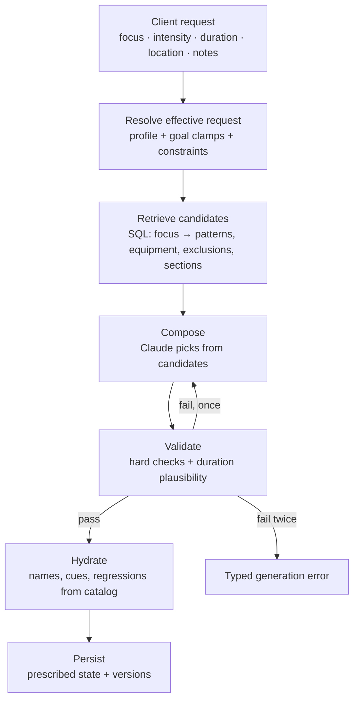

# CLEAR — Generation Contract v4.1

> **Status:** proposal, revision 2
> **Revision 2:** output nests exercises under blocks · `rounds` removed as a modality · targets discriminated (fixed / range / sequence) · validation and duration operate on blocks.
> **Status:** proposal, for review
> **Implements:** `CHANGE_SET_v0.4.md` rev 3 §4 · `DATA_MODEL.md` §6
> **Replaces:** prompt v4.0.0 and the current `generate-workout` handler contract
> **Principle:** Claude composes. Code decides eligibility, computes duration, and owns facts.

---

## 1. The pipeline



Everything before **Compose** is deterministic. Everything after it is deterministic. Claude occupies exactly one step, and it is the one requiring judgment.

---

## 2. What moves out of the prompt

The current system prompt describes ~24 rules and the validator checks four. Rules enforced by a query cannot be forgotten by a model, so the enforceable ones move.

| Rule, today in prose | Becomes |
|---|---|
| Exercise Inclusion Rule — anchor match or role justification | The eligibility `WHERE` clause (§3) |
| *"Upper Body → Press OR Pull"* | A `focus_pattern_map` join |
| Equipment availability | `equipment_options && available` |
| Enabled sections | Per-section candidate lists |
| *"You MUST only use exercise_id values from this list"* | Structurally true — Claude only sees eligible IDs |
| Full library dump (~140 exercises, all metadata) | ~40 candidates per request, fewer fields each |
| Duration must fit ±10% | Computed and checked in code (§7) |
| Canonical names, equipment strings, cues, regressions | Hydrated by ID (§6) |

**Stays in the prompt** — these are composition judgment and belong to the model: the session arc · goal character and relationship ratios · intensity guidance · structure-type definitions · warmup component coverage · cooldown muscle targeting · variety · section scaling · ordering and pairing.

**Effect:** the system prompt drops roughly 40%, the candidate payload roughly 70%. Fewer input tokens, fewer output tokens, and fewer retries — the retry being the largest single latency cost, since it runs the whole generation twice.

---

## 3. Candidate retrieval

Runs before the prompt is built. One query per section.

```sql
WITH focus_patterns AS (
  SELECT movement_pattern FROM focus_pattern_map WHERE session_focus = $1
),
excluded_exercises AS (
  SELECT target_exercise_id FROM user_constraints
  WHERE user_id = $2 AND action = 'exclude' AND scope = 'exercise'
),
excluded_patterns AS (
  SELECT target_pattern FROM user_constraints
  WHERE user_id = $2 AND action = 'exclude' AND scope = 'movement_pattern'
),
excluded_equipment AS (
  SELECT target_equipment FROM user_constraints
  WHERE user_id = $2 AND action = 'exclude' AND scope = 'equipment'
)
SELECT ec.id, ec.name, ec.movement_patterns, ec.exercise_role,
       ec.component_movements, ec.muscles, ec.can_be_primary,
       ARRAY(SELECT e FROM unnest(ec.equipment_options) e
             WHERE e = ANY($3) AND e <> ALL(SELECT * FROM excluded_equipment)) AS usable_equipment
FROM exercise_catalog ec
WHERE
  -- thematic eligibility: pattern match, or a role that is focus-exempt
  ( ec.movement_patterns && ARRAY(SELECT * FROM focus_patterns)
    OR ec.exercise_role = ANY(ARRAY['conditioning','mobility','activation','cardio','stability']::exercise_role[]) )
  -- section eligibility
  AND ec.sections @> ARRAY[$4::section_type]
  -- equipment: at least one usable option survives
  AND ec.equipment_options && $3
  -- user constraints
  AND ec.id <> ALL (SELECT * FROM excluded_exercises)
  AND NOT (ec.movement_patterns && ARRAY(SELECT * FROM excluded_patterns))
  AND EXISTS (SELECT 1 FROM unnest(ec.equipment_options) e
              WHERE e = ANY($3) AND e <> ALL(SELECT * FROM excluded_equipment));
```

`usable_equipment` is computed per candidate, so Claude only ever sees equipment it is allowed to choose. An exercise whose every option is excluded never appears.

**Fallback:** if a section yields fewer than a floor (suggest 8), relax the pattern predicate for that section only and record `relaxed: true` on the request. The current code has a similar escape at 20 exercises; making it per-section and recorded means a thin library shows up in diagnostics instead of silently widening.

**Soft constraints** — `avoid` and `prefer_not` — do **not** filter. They pass to Claude as a short "deprioritize these" list. They cannot make a workout unsafe because eligibility already ran; they only reorder valid options.

---

## 4. What Claude receives

**System prompt:** composition rules only, per §2.

**User prompt:**

```
EFFECTIVE REQUEST
  focus: lower_body      intensity: 7 (requested 8, clamped by goal)
  goal: strength         duration: 45 min
  experience: confident  location: Home Gym

RECENT HISTORY
  last 3 focuses: upper_body, full_body, lower_body
  patterns trained this week: press(3) pull(2) squat(1)
  avoid repeating: back-squat, rdl, barbell-row, ...

DEPRIORITIZE (soft user preference)
  exercise: box-jump — "prefer not"

NOTES (context only — not a constraint)
  "left shoulder has been a bit cranky"

CANDIDATES — primary_lift
  deadlift | patterns:[hinge] | role:compound_lift | components:[hip-hinge,posterior-chain-activation,grip,brace]
           | muscles:[hamstrings:primary,glutes:primary,erectors:synergist] | equipment:[barbell,trap-bar] | can_be_primary
  ...

CANDIDATES — accessory
  ...
```

Candidates are grouped by section, carry only what composition needs, and never include coaching cues or regressions — those are hydrated later and would be output tokens spent reproducing data already stored.

---

## 5. What Claude returns

```jsonc
{
  "title": "string",
  "overview": "string",
  "sections": [{
    "section_type": "conditioning",
    "section_title": "string",
    "section_notes": "string | null",

    "blocks": [{
      "structure_type": "amrap",        // standard|superset|circuit|emom|amrap|for_time
      "rounds": null,                   // fixed rounds; null when open-ended
      "timer_type": "countdown",        // none|count_up|countdown|interval|per_minute
      "timer_seconds": 720,             // required for emom|amrap|for_time
      "round_rest_seconds": null,
      "rep_scheme": "fixed",
      "block_notes": "string | null",

      "exercises": [{
        "exercise_id": "kb-swing",      // MUST be from this section's candidates
        "equipment": "kettlebell",      // MUST be from that candidate's usable_equipment

        "session_function": "conditioning", // prep|primary|accessory|balance|core|conditioning|recovery
        "anchor_relationship": "complementary", // direct|complementary|neutral

        "modality": "reps",             // reps|time|distance  — NOT rounds
        "sets": null,                   // null inside open-ended blocks
        "target_kind": "fixed",         // fixed|range|sequence
        "target_value": 15,             // fixed
        "target_min": null,             // range
        "target_max": null,             // range
        "target_sequence": null,        // sequence: [15,12,9,6,3]
        "per_side": false,
        "distance_unit": null,          // required when modality = distance
        "rest_seconds": null,
        "tempo": null,

        "load_type": "absolute",        // percent_1rm|rir|bodyweight|prior_session|absolute|none
        "load_value": 24,
        "is_interval_exercise": false
      }]
    }]
  }],
  "estimated_duration_mins": 46         // DIAGNOSTIC ONLY — never validated against
}
```

**Removed from v4.0:** `name` · `regression` · `effort_percent` (folded into `load_type`/`load_value`) · free-form `reps` string.

**Two structural changes.**

**Exercises nest under blocks.** Structure properties — type, rounds, timer, round rest — belong to the block, so members of a circuit cannot disagree about the clock. It also means a conditioning section can hold an EMOM *and* an AMRAP, which the old section-keyed model could not record.

**Targets are discriminated.** `"15-12-9-6-3"` arrives as `target_kind: "sequence"` with `target_sequence: [15,12,9,6,3]`. An `8–10` rep range arrives as `target_kind: "range"`. An integer array alone could not tell those apart. `per_side` handles unilateral work; `distance_unit` handles distance. **`rounds` is not a modality** — an exercise inside an AMRAP still prescribes reps or time per round; the block is what repeats.

**`estimated_duration_mins` survives as diagnostic.** Comparing Claude's estimate to the computed one is a free signal about whether the model understands the time cost of what it composed. It is never authoritative.

`session_function` and `anchor_relationship` split what v4.0 crammed into one relationship field: what job an exercise does, and how it relates to the day's focus. An exercise can be an accessory that is thematically neutral — one field could not say that.

---

## 6. Validation

### Hard — reject, retry once, then fail typed

| # | Check |
|---|---|
| 1 | Every `exercise_id` is in **that section's candidate set** — stricter than "in the library" |
| 2 | Every `equipment` is in that candidate's `usable_equipment` |
| 3 | Every `section_type` is enabled for the user |
| 4 | Target shape matches `target_kind` — exactly the right fields populated |
| 5 | `distance_unit` present when `modality = 'distance'` |
| 6 | Blocks of type `emom`/`amrap`/`for_time` carry `timer_seconds`; `circuit` carries `rounds` |
| 7 | `load_value` present unless `load_type` ∈ {bodyweight, prior_session, none} |
| 8 | **Computed duration within tolerance** (§7) |

Checks 4–7 mirror the schema's CHECK constraints, so a workout that validates is a workout that can be persisted. Failing at the boundary beats failing at the INSERT.

### Soft — record, never reject

Relationship ratios against goal · warmup component coverage · variety (component overlap within a section) · pattern repetition against recent history.

These are stored on the session as a quality record. They are the observability layer that tells you whether the prompt is working, and they are **explicitly not gates** — a soft rule that rejects is a hard rule with a soft name.

---

## 7. Duration plausibility

Purpose: reject workouts that clearly cannot fit. Not predict completion time.

```
per block:
  standard   → Σ members: sets × WORK_PER_SET + (sets − 1) × rest_seconds
  superset   → rounds × Σ(member work) + (rounds − 1) × round_rest_seconds
  circuit    → rounds × Σ(member work) + (rounds − 1) × round_rest_seconds
  emom       → timer_seconds
  amrap      → timer_seconds
  for_time   → timer_seconds            (the full cap — the user may need all of it)

per section:
  Σ blocks + (exercise_count × TRANSITION)

per workout:
  Σ sections + (section_count × TRANSITION)

constants:  WORK_PER_SET ≈ 30–45s      TRANSITION ≈ small fixed allowance
tolerance:  ~15–20%
```

Shared rest is counted once per round because it lives on the block. That is the normalization fix doing real work — under the old shape, rest duplicated across three circuit members could be summed three times.

Constants live in the `GEN-06` module. **No metadata table, no per-exercise override, no tempo parsing, no seconds-per-rep classification.**

**On failure:** report which *block* overran and by how much, so the retry prompt is specific rather than a blind re-roll.

**Why crude is enough.** Today `validateWorkout` compares `estimated_duration_mins` — a number Claude was told the answer to — against the request. The check cannot fail. Any independent computation is strictly better; the bar is zero.

---

## 8. Hydration

After validation, before persistence, code fills in every fact from the catalog: display name, `equipment_display_names` resolution, coaching cues, regression reference, muscle groups.

Two reasons, and the second is the one that matters. It saves output tokens — but more importantly, a model reproducing facts it cannot verify is how facts drift. Hydration makes drift structurally impossible rather than something validation has to catch.

---

## 9. Errors

Every failure returns `{ code, message, requestId }` per `CORE-01`. Generation-specific codes:

| Code | Meaning | Retryable |
|---|---|---|
| `generation.no_candidates` | A required section yielded nothing eligible | No — usually over-constrained equipment or exclusions |
| `generation.invalid_reference` | Returned an ID or equipment outside the candidate set | Once |
| `generation.malformed_prescription` | Failed checks 4–7 | Once |
| `generation.duration_implausible` | Outside tolerance | Once, with the overrunning section named |
| `generation.upstream` | Claude API failure | Once |
| `generation.exhausted` | Retry also failed | No |

**No silent fallback.** There is no mock workout in this codebase — that was D2, and `GEN-03` enforces its absence with a grep gate.

---

## 10. Versioning

Every session records `prompt_version` (exists) and `contract_version` (new). Contract version changes when the output shape changes; prompt version changes when composition rules change. Independent, because they change for different reasons.

This contract is `4.1.0`. Prompt version bumps to `5.0.0` — the library section is gone, the anchor section is rewritten, and the enforcement rules have moved out.

---

## 11. Requirement mapping

| Requirement | Section |
|---|---|
| `GEN-01` envelope | §9 errors, `requestId` echo |
| `GEN-02` generation | §3–§6, §8, §10 |
| `GEN-06` duration | §7 |
| `CORE-03` boundary schemas | §5 output shape |
| `DATA-05` constraints | §3 hard exclusions, soft list |
| `REV-02` swap | Same contract, single-slot scope |
| `SES-01` persistence | §8 output maps 1:1 to `workout_exercises` |

---

## 12. Open

1. **Candidate floor per section** — 8 is a guess. Tune against the real library once sections are queried.
2. **Soft-constraint ranking** — `avoid` and `prefer_not` reach Claude as a list; deterministic ranking is deferred, and the UI exposes `exclude` only until it exists.
3. ~~`work_targets` for `rounds` modality~~ — **resolved.** Rounds belong to the block; exercises prescribe reps, time, or distance per round.
4. **Retry budget** — one retry retained. Whether a duration failure should trim rather than regenerate is worth testing; trimming is cheaper and often correct.
5. **Quality record storage** — §6 soft checks need somewhere to live. A column on the session is probably enough; a table is probably premature.
