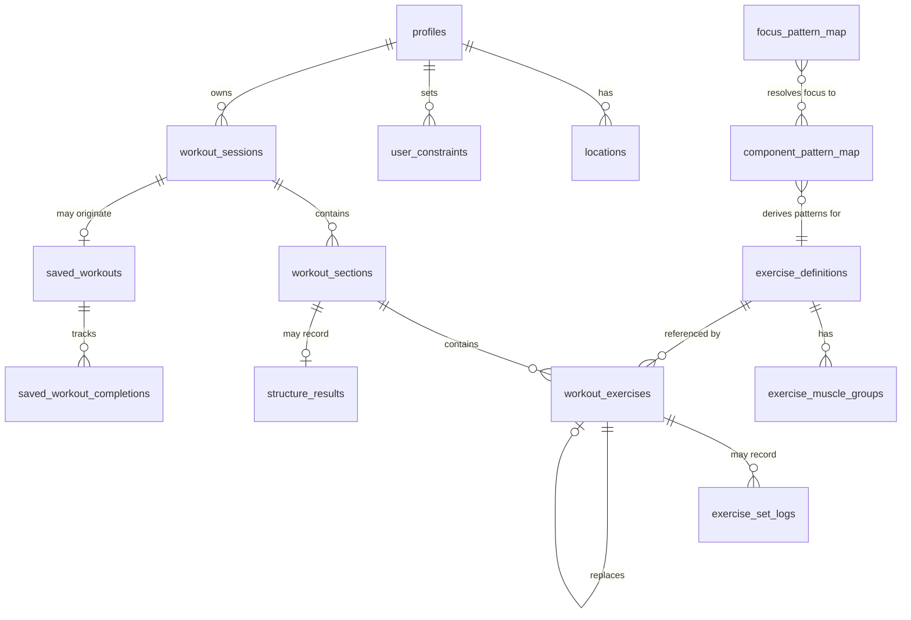
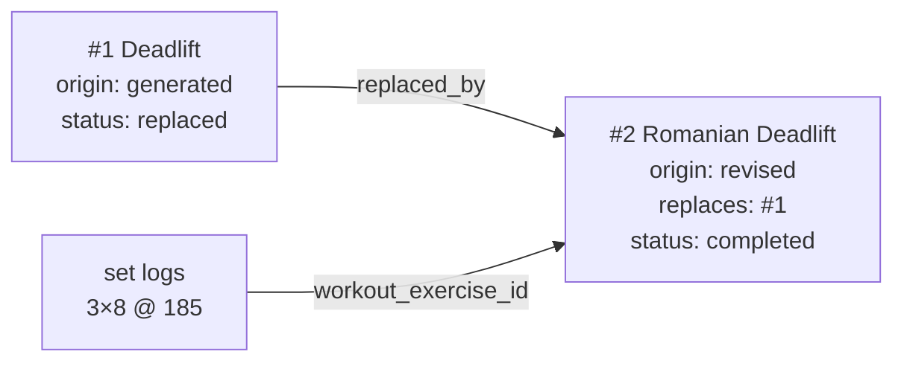

# CLEAR — Data Model

> **Status:** proposal, for review
> **Implements:** `CHANGE_SET_v0.4.md` revision 3
> **Scope:** the smallest coherent schema that fixes D5 and D6, supports the three-state model, and does not block cautious adaptation later.
> **Target:** one Postgres database (Supabase). RLS on every user table.

---

## 1. What this has to demonstrate

The change set stated obligations rather than claiming them. This document has to show them:

| Obligation | Where |
|---|---|
| Reconstruct prescribed / revised / performed | §6 lineage · §7 |
| Partial log without null meaning zero or skip | §8 |
| Preserve revisions and execution through regeneration | §6 · §7 |
| Execution attaches to the exercise actually performed | §7 |
| Duration computed independently of Claude | §6 prescription fields |
| Deterministically exclude constrained exercises before composition | §5 · §3 |
| Retain requested and effective generation inputs | §6 |
| Retain prompt and contract versions | §6 |
| One Postgres deployment, no artificial boundaries | throughout |

---

## 2. Domains



Four domains, one database:

**Catalog** — canonical, read-only to clients: `exercise_definitions`, `exercise_muscle_groups`, `component_pattern_map`, `focus_pattern_map`.
**User baseline** — `profiles`, `locations`, `user_constraints`.
**Workout** — `workout_sessions`, `workout_sections`, `workout_exercises`.
**Execution** — `exercise_set_logs`, `structure_results`.

---

## 3. The taxonomy split

### The finding

The pattern layer already exists, and it is better than the anchor enum.

`exercise_definitions.component_movements` is populated across **142 exercises** with 20 values — and it distinguishes `vertical-press` from `horizontal-press`, `vertical-pull` from `horizontal-pull`, which the flat `press`/`pull` anchors do not.

**No re-tagging is required.** Movement patterns derive from data already authored.

### Component vocabulary, sorted

**Pattern-bearing** — these define what a movement *is*:

| Component | Count | Pattern |
|---|---|---|
| `knee-flexion` | 27 | squat |
| `hip-hinge` | 20 | hinge |
| `vertical-press` | 18 | press |
| `horizontal-press` | 13 | press |
| `triple-extension` | 17 | power |
| `horizontal-pull` | 7 | pull |
| `vertical-pull` | 5 | pull |
| `single-leg-stability` | 11 | unilateral |
| `cardio-output` | 12 | conditioning |

**Quality-bearing** — these describe demands, not patterns, and stay exactly where they are for the warmup component-coverage rule: `brace` (61) · `scapular-control` (25) · `posterior-chain-activation` (25) · `grip` (25) · `hip-mobility` (22) · `shoulder-mobility` (14) · `ankle-mobility` (8) · `anti-rotation` (7) · `thoracic-mobility` (3) · `landing-mechanics` (3) · `anti-lateral-flexion` (2).

### The two mapping tables

```sql
-- Component primitive → coarse movement pattern.
-- Only pattern-bearing components appear. Absence means "quality, not pattern."
CREATE TABLE component_pattern_map (
  component        text PRIMARY KEY,
  movement_pattern movement_pattern NOT NULL
);

-- Session focus → the patterns that satisfy it.
CREATE TABLE focus_pattern_map (
  session_focus    session_focus     NOT NULL,
  movement_pattern movement_pattern  NOT NULL,
  is_primary       boolean NOT NULL DEFAULT true,
  PRIMARY KEY (session_focus, movement_pattern)
);
```

Seeded content:

| focus | patterns |
|---|---|
| `upper_body` | press, pull |
| `lower_body` | squat, hinge, unilateral |
| `full_body` | squat, hinge, press, pull, unilateral |
| `power` | power |

**`power` resolves cleanly** — it maps to `triple-extension`, a real movement primitive shared by power cleans, hang cleans, and push presses. It stops being a special case bolted onto a pattern enum.

An exercise's patterns are derived, not stored:

```sql
CREATE VIEW exercise_patterns AS
SELECT DISTINCT ed.id AS exercise_id, m.movement_pattern
FROM exercise_definitions ed
CROSS JOIN LATERAL unnest(ed.component_movements) AS c(component)
JOIN component_pattern_map m ON m.component = c.component;
```

Correcting a mapping updates every exercise at once. Nothing drifts.

### Cascade — everything the split touches

| # | Affected | Change |
|---|---|---|
| 1 | `workout_sessions.anchor` | → `session_focus` column, `session_focus` enum |
| 2 | `exercise_anchors` table | **Dropped.** Pattern data is redundant with `component_movements`; its region tags (`full_body`×3, `upper_body`, `lower_body`) were the conflation being removed |
| 3 | `anchor_type` enum | **Dropped**, replaced by `session_focus` + `movement_pattern` |
| 4 | `suggest_anchor()` RPC | → `suggest_session_focus()`. Can now also report pattern-level staleness — *"no hinge in 11 days"* rather than *"no lower body"* |
| 5 | `exercise_definitions_with_anchors` view | → `exercise_catalog` (§4), joining derived patterns |
| 6 | `exercises_with_context` view | Regenerated against renamed tables |
| 7 | Generation prompt | *"Upper Body → Press OR Pull"* prose becomes a `focus_pattern_map` query. Removed from the prompt entirely |
| 8 | Candidate filtering | `filterByAnchor()` → join through `focus_pattern_map` + `exercise_patterns`, plus role-exempt exercises as today |
| 9 | `HOME-03` suggested focus | More precise; pattern-level staleness available |
| 10 | Weekly coverage | Gains a pattern axis alongside muscle groups |
| 11 | Generation screen | **No visual change.** Same four options; the field it writes is renamed |
| 12 | `saved_workouts.anchor` (TEXT) | → `session_focus` enum |
| 13 | Generated types | Regenerate (`DATA-03`) |
| 14 | Prompt version | Bump — the anchor section is rewritten |

**Honest note:** `conditioning` appears as a derived pattern (via `cardio-output`) but is not in any focus mapping. Conditioning is a *section*, not a focus, and stays that way. The pattern exists so coverage tracking can see it.

---

## 4. Catalog

Canonical facts. Read-only to clients — RLS grants `SELECT` to authenticated users and nothing else. This is where Claude's hydration comes from (§6), so nothing here is ever written by generation.

`exercise_definitions` carries forward unchanged in shape. Two type corrections: `exercise_role` and `exercise_muscle_groups.role` become enums (§9), matching the discipline the rest of the schema already uses.

```sql
CREATE VIEW exercise_catalog AS
SELECT
  ed.*,
  ARRAY(SELECT ep.movement_pattern FROM exercise_patterns ep
        WHERE ep.exercise_id = ed.id)                          AS movement_patterns,
  ARRAY(SELECT jsonb_build_object('muscle', emg.muscle_group, 'role', emg.role)
        FROM exercise_muscle_groups emg WHERE emg.exercise_id = ed.id) AS muscles
FROM exercise_definitions ed;
```

One view is what candidate retrieval and fact hydration both read.

---

## 5. User baseline

### `profiles` — revised

**Dropped:** `streak_count`, `streak_status`, `streak_pause_reason`, `streak_pause_start`, `streak_start_date`, `consecutive_rest_days`.

Six columns of stored derived state that can drift from the sessions they summarize. Backdate or delete a session and the count is silently wrong with nothing to detect it. Streak becomes a function over `workout_sessions` — `HOME-02` already requires it as pure tested functions, so this removes a duplicate source of truth rather than adding work.

**Added:** `weight_unit weight_unit NOT NULL DEFAULT 'lb'` — the profile-level default. Set logs carry their own unit (§8) so historical records stay honest if the default ever changes.

**Unchanged:** `experience_level`, `goal_preset`, `limitations`, `enabled_sections`, `default_location_id`, `onboarding_completed`.

### `user_constraints` — new · `DATA-05` · confirmed

```sql
CREATE TABLE user_constraints (
  id             uuid PRIMARY KEY DEFAULT gen_random_uuid(),
  user_id        uuid NOT NULL REFERENCES auth.users(id) ON DELETE CASCADE,
  scope          constraint_scope  NOT NULL,   -- exercise | movement_pattern | equipment
  action         constraint_action NOT NULL,   -- exclude | avoid | prefer_not
  persistence    constraint_persistence NOT NULL DEFAULT 'persistent',
  target_exercise_id  text             REFERENCES exercise_definitions(id),
  target_pattern      movement_pattern,
  target_equipment    text,
  note           text,
  created_at     timestamptz NOT NULL DEFAULT now(),
  expires_after_session_id uuid REFERENCES workout_sessions(id),

  CONSTRAINT exactly_one_target CHECK (
    num_nonnulls(target_exercise_id, target_pattern, target_equipment) = 1
  ),
  CONSTRAINT target_matches_scope CHECK (
    (scope = 'exercise'         AND target_exercise_id IS NOT NULL) OR
    (scope = 'movement_pattern' AND target_pattern     IS NOT NULL) OR
    (scope = 'equipment'        AND target_equipment   IS NOT NULL)
  )
);
```

Three scopes, all enforceable against catalog data that exists today. **No impact scope** — the catalog cannot enforce it, and offering a constraint the system silently ignores is worse than not offering it.

`note` is context. It is never parsed, never converted into a rule, and never consulted by the eligibility query. Free text may reach Claude as best-effort composition context; a deterministic exclusion always comes from an explicit row here.

**Eligibility, resolved before composition:**

```sql
-- Hard exclusions. Runs in the query, not the prompt.
SELECT ec.* FROM exercise_catalog ec
WHERE ec.id <> ALL (SELECT target_exercise_id FROM user_constraints
                    WHERE user_id = $1 AND action = 'exclude' AND scope = 'exercise')
  AND NOT (ec.movement_patterns && ARRAY(SELECT target_pattern FROM user_constraints
                    WHERE user_id = $1 AND action = 'exclude' AND scope = 'movement_pattern'))
  AND NOT (ec.equipment_options <@ ARRAY(SELECT target_equipment FROM user_constraints
                    WHERE user_id = $1 AND action = 'exclude' AND scope = 'equipment'));
```

The equipment clause excludes only exercises whose *every* option is excluded — a barbell exclusion shouldn't remove an exercise that also works with dumbbells.

---

## 6. Workout — prescription

### `workout_sessions` — revised

```sql
-- taxonomy
session_focus       session_focus NOT NULL,     -- replaces anchor

-- requested vs effective (change set §5)
requested_intensity int  NOT NULL,
effective_intensity int  NOT NULL,
requested_duration_mins int NOT NULL,
effective_duration_mins int NOT NULL,
adjustment_reason   text,                        -- why they differ, when they do

-- governance (I7, minimum)
prompt_version      text NOT NULL,               -- exists today
contract_version    text NOT NULL,               -- new

-- unchanged
user_id, date, goal_preset, location_id, duration_mins,
is_rest_day, rest_day_reason, counts_for_streak,
mood, session_notes, started_at, completed_at, generation_notes
```

`mood` becomes `smallint CHECK (mood BETWEEN 1 AND 5)` — it is `text` today for a 1–5 rating.

Requested and effective are separate columns rather than a diff, because the question *"why did I ask for 60 and get 45?"* should be answerable by reading one row.

### `workout_exercises` — renamed from `exercises`, substantially revised

The rename matters. This table holds **prescribed exercise instances**; `exercise_definitions` holds exercises. The collision is confusing enough that I misread it earlier in this project.

```sql
CREATE TABLE workout_exercises (
  id            uuid PRIMARY KEY DEFAULT gen_random_uuid(),
  section_id    uuid NOT NULL REFERENCES workout_sections(id) ON DELETE CASCADE,
  exercise_id   text NOT NULL REFERENCES exercise_definitions(id),
  order_index   int  NOT NULL,

  -- ── structured prescription (change set §6) ──
  modality        prescription_modality NOT NULL,  -- reps|time|distance|rounds
  sets            int,
  work_targets    int[],          -- meaning set by modality; ordered for ladders
  rep_scheme      rep_scheme      NOT NULL DEFAULT 'fixed',
  rest_seconds    int,
  round_rest_seconds int,
  tempo           text,           -- display only; not consumed by duration

  load_type       load_guidance,  -- percent_1rm|rir|bodyweight|prior_session|absolute|none
  load_value      numeric,

  structure_type    structure_type NOT NULL DEFAULT 'standard',
  structure_group_id text,
  timer_type        timer_contract NOT NULL DEFAULT 'none',
  timer_seconds     int,
  is_interval_exercise boolean NOT NULL DEFAULT false,

  equipment_used  text NOT NULL,

  -- ── lineage (I1) ──
  replaces_id   uuid REFERENCES workout_exercises(id),
  origin        prescription_origin NOT NULL DEFAULT 'generated',  -- generated|revised

  -- ── execution status (I3) ──
  status        item_status NOT NULL DEFAULT 'not_started',
                -- not_started|completed|skipped|replaced

  exercise_notes text,
  created_at, updated_at,

  CONSTRAINT work_targets_present CHECK (
    modality = 'rounds' OR (work_targets IS NOT NULL AND array_length(work_targets,1) > 0)
  ),
  CONSTRAINT timed_structures_have_a_clock CHECK (
    structure_type NOT IN ('emom','amrap','for_time') OR timer_seconds IS NOT NULL
  ),
  CONSTRAINT grouped_structures_have_a_group CHECK (
    structure_type = 'standard' OR structure_group_id IS NOT NULL
  ),
  CONSTRAINT load_value_matches_type CHECK (
    load_type IN ('bodyweight','prior_session','none') OR load_value IS NOT NULL
  )
);
```

**`work_targets` as an ordered array is the piece that removes string parsing.** `"15-12-9-6-3"` becomes `{15,12,9,6,3}` — five ordered targets the ladder renderer indexes directly, duration sums, and progression reads to know which rung was reached. A fixed prescription is `{8}`. Modality determines whether those integers are reps, seconds, or metres.

**`effort_percent` is dropped**, folded into `load_type='percent_1rm'` + `load_value`. One concept, one representation.

### Duration plausibility — code, not schema

Everything `GEN-06` needs is already above: `sets`, `work_targets`, `rest_seconds`, `round_rest_seconds`, `structure_type`, `timer_seconds`. Allowances live as constants in the function. **No metadata table, no override column, no per-exercise data.**

---

## 7. The three states — how lineage actually works

**Mechanism: append and supersede. No row is ever mutated into a different exercise.**

When a swap happens, a new `workout_exercises` row is inserted with `replaces_id` pointing at the old one and `origin = 'revised'`. The old row stays, its `status` set to `'replaced'`.



That one arrow is D6. Today the logs point at row #1 — an exercise never performed.

**The three states read out as queries, not as separate tables:**

| State | Query |
|---|---|
| **as generated** | `WHERE origin = 'generated'` |
| **as intended at start** | `WHERE status <> 'replaced'` |
| **as performed** | join `exercise_set_logs` — which can only reach active rows |

`replaces_id` chains, so a slot swapped three times reconstructs in order. Regeneration of a section supersedes that section's rows and leaves untouched sections alone — preserving unaffected revisions without special-casing.

**Why not whole-workout versioning:** it would duplicate every unchanged row on every swap, and make "what did I actually do" a version-reconciliation problem instead of a filter. I1 asks for reconstructability and lineage, not snapshots.

---

## 8. Execution

### `exercise_set_logs` — revised

```sql
workout_exercise_id  uuid NOT NULL REFERENCES workout_exercises(id) ON DELETE CASCADE,
set_number      int  NOT NULL,
reps_prescribed int,                 -- snapshot from work_targets at log time
reps            int,                 -- nullable: not recorded
weight          numeric,             -- nullable: not recorded
weight_unit     weight_unit NOT NULL,
rpe             numeric(3,1),        -- nullable: not recorded
is_warmup_set   boolean NOT NULL DEFAULT false,
UNIQUE (workout_exercise_id, set_number)
```

**Missing-data semantics (I3), concretely:**

- **A row exists** → the user engaged with this set.
- **A null value** → not recorded. Never zero, never a skip.
- **Zero** → a real recorded result. `reps = 0` means a failed attempt, and it is distinguishable from `reps IS NULL`.
- **No row** → not recorded at that set number.
- **Skipped** → `workout_exercises.status = 'skipped'`. A real observation, distinct from silence.

No reason code beside every field. Status lives on the item; values are plainly nullable.

`reps_prescribed` is snapshotted at log time rather than joined, so a later revision to the prescription cannot retroactively change what a completed set was measured against.

`weight_unit` is per-row, not inherited. A profile default that changes must not silently reinterpret history — that is an injury path, not a display bug.

### `structure_results` — revised

`structure_type` and `rep_scheme` become enums. Three columns added, per `EXE-03`/`EXE-04`, which capture data M3 will need and nothing before it uses:

```sql
perceived_effort  smallint CHECK (perceived_effort BETWEEN 1 AND 10),  -- section RPE
partial_reps      int,          -- AMRAP partial round
minutes_completed int           -- EMOM completion
```

Captured from M1 forward. Cheap now, unrecoverable later — you cannot retroactively record how a session felt.

---

## 9. Enums

**New:** `session_focus` (upper_body, lower_body, full_body, power) · `movement_pattern` (squat, hinge, press, pull, unilateral, power, conditioning) · `prescription_modality` (reps, time, distance, rounds) · `timer_contract` (none, count_up, countdown, interval, per_minute) · `load_guidance` (percent_1rm, rir, bodyweight, prior_session, absolute, none) · `prescription_origin` (generated, revised) · `item_status` (not_started, completed, skipped, replaced) · `constraint_scope` (exercise, movement_pattern, equipment) · `constraint_action` (exclude, avoid, prefer_not) · `constraint_persistence` (session, persistent) · `weight_unit` (lb, kg).

**Converted from TEXT** — closed sets that were inconsistent with the schema's own conventions: `structure_type` · `rep_scheme` · `exercise_role` · `muscle_role`.

**Dropped:** `anchor_type`.

---

## 10. Dropped, renamed, derived

| Was | Now | Why |
|---|---|---|
| `exercises` | `workout_exercises` | It holds prescribed instances, not exercises. The collision caused a real misread |
| `exercises.reps` TEXT | `modality` + `work_targets[]` | One column held four data types |
| `exercises.weight_logged` TEXT | *dropped* | Superseded by `exercise_set_logs`; free text like `"185lbs x 8,8,8,7"` looked usable and wasn't |
| `exercises.coaching_cues` TEXT | *dropped* | Hydrated from `exercise_definitions.coaching_cues` (TEXT[]). The snapshot flattened an array into a string |
| `exercises.effort_percent` | `load_type` + `load_value` | Folded |
| `exercise_anchors` | *dropped* | Patterns derive from `component_movements`; region tags were the conflation |
| `anchor_type` | `session_focus` + `movement_pattern` | Three concepts in one enum |
| `profiles` streak ×6 | *derived* | Stored derived state that drifts |
| `workout_sessions.mood` TEXT | `smallint` 1–5 | It is a rating |

---

## 11. Requirement mapping

| Requirement | This document |
|---|---|
| `DATA-01` | §4–§8 entire baseline |
| `DATA-02` | Catalog seeds unchanged; `exercise_anchors` no longer imported |
| `DATA-03` | Regenerate against §9 enums |
| `DATA-05` | §5 `user_constraints` |
| `GEN-02` | §4 hydration source, §6 prescription shape |
| `GEN-06` | §6 — all inputs present, allowances as code constants |
| `SES-01` | §7 — D6 reproduction becomes the regression test |
| `REV-02`, `REV-03` | §7 append-and-supersede |
| `EXE-02`–`EXE-05` | §6 `work_targets`, `timer_contract`; §8 logging |
| `HOME-02` | §5 — streak has one source now |
| `HOME-03` | §3 — pattern-level staleness |
| `OVR-01` | §8 `reps_prescribed`; `load_anchors` remains M3, not built here |

---

## 12. Open

1. **`work_targets` for `rounds` modality** — AMRAP prescribes work per round, and rounds are open-ended. Current shape allows null targets for `rounds`; may want per-round targets in a second array. Resolve when EXE-04 is built against real AMRAP data.
2. **`avoid` and `prefer_not` enforcement** — hard `exclude` runs in SQL (§5). The softer actions need a ranking layer that does not exist yet; they persist correctly but currently only reach Claude as composition context.
3. **After-start regeneration** — schema supports superseding an unperformed exercise mid-session; the *policy* for what locks once a workout starts is still an open product decision.
4. **Global working-weight scope** — unresolved; affects `load_type = 'prior_session'` resolution.
5. **`conditioning` pattern** — derived but unmapped to any focus. Correct for now; revisit if conditioning ever becomes a selectable focus.

---

## 13. Not in this schema — deliberately

`load_anchors` and derived athlete state (M3, `OVR-01`) · quality scoring · session blueprint and candidate ranking as stored artifacts — they are code · impact and technical-demand metadata · analytics events · wearables · calendar programming.
