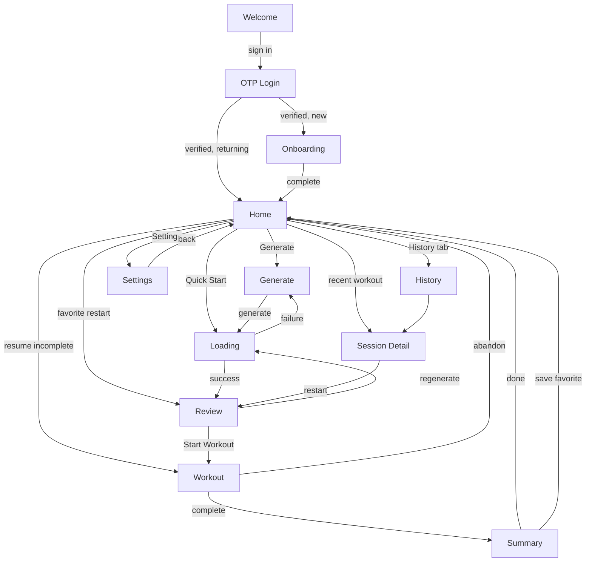

# Information Architecture

> **Status:** DRAFT — for review
> **Purpose:** the missing layer between *what a screen does* (requirements) and *what components exist* (design system). This says **which components compose which screen, in what states, reached from where.**
> **Consumers:** whoever builds a UI requirement. Read the screen entry before writing markup.
> **Companion:** `specs/design/ATOMIC.md` — gated on the Claude Design export — will specify each component's variants, states, and token bindings. This document names the vocabulary; that one defines it.

---

## Why this exists

The requirements specify **behavior** and the design system specifies **components**, but nothing said which components assemble into which screen. An agent handed EXE-03 knew what a circuit renderer must *do* and had a component library to build from — and would have invented an arrangement. Twenty UI requirements, twenty inventions, and a design system that rots on contact.

This document closes that gap. Every screen entry is a build contract: route, guard, entry points, exits, the four CORE-04 states, its component tree, and the requirements that own it.

**The rule it enforces:** if a screen needs something not in the vocabulary below, that is a **new component requirement in the DS trunk** — not an inline one-off. Adding to the vocabulary is a deliberate act with a ticket attached.

---

## 1. Route map

| Route | Guard | Screen | Purpose | Requirements |
|---|---|---|---|---|
| `/welcome` | public-only | Welcome | Entry for signed-out visitors | AUTH-02 |
| `/login` | public-only | OTP Login | Email code request + verify | AUTH-02 |
| `/onboarding` | authed, not onboarded | Onboarding | First-run profile setup | ONB-01 |
| `/` | protected | Home | Daily entry point | HOME-01, HOME-02, HOME-03 |
| `/generate` | protected | Generate | Configure a workout | GEN-04, OVR-04 |
| `/review` | protected + workout in state | Review | Pre-workout briefing, swaps | REV-01, REV-03, OVR-01 |
| `/workout` | protected + active session | Workout | Execution | EXE-01…05, OVR-03 |
| `/summary` | protected + completed session | Summary | Debrief | SUM-01, FAV-01 |
| `/history` | protected | History | Past workouts + favorites | HIST-01, FAV-01 |
| `/history/:id` | protected | Session Detail | One workout, fully expanded | HIST-01 |
| `/settings` | protected | Settings | Hub + 4 sub-views | SET-01, SET-02 |
| `/dev/gallery` | dev only | Component Gallery | Every component, every state | DS-07 |
| `*` | — | Not Found | Fallback | ENV-01 |

**Guard semantics (AUTH-03).** `public-only` redirects authenticated users away. `protected` redirects unauthenticated users to `/welcome`. The onboarding gate redirects authenticated-but-not-onboarded users to `/onboarding` from any protected route. A failed profile fetch renders an **error state** — never the onboarding gate. That distinction is defect D1 and it is a guard-level rule, not a screen-level one.

**State-dependent guards.** `/review`, `/workout`, and `/summary` require session state, not just auth. Landing on `/workout` with no active session redirects Home rather than rendering an empty shell.

---

## 2. Navigation graph



**The loop that matters** is Home → Generate → Loading → Review → Workout → Summary → Home. Everything else is a branch off it. M1's gate is exactly this loop working end to end on a phone.

**Three ways into Review**, and they matter for REV-01's state handling: fresh generation (from Loading), regeneration (discards the previous workout, confirm first), and favorite restart (a stored snapshot, no generation call at all).

---

## 3. Component vocabulary

**Read `specs/design/ATOMIC.md` first.** `clear-design-system@0.5.0` ships 18 React
components, 75 icons and a set of `.clr-*` classes. This section maps the names this
document has used since before the export landed onto what actually exists.

Four layers. A screen composes from these; anything missing is a new DS requirement —
and after the export there are only **three** of those.

### Layer 1 — Primitives

| IA name | Real | Notes |
|---|---|---|
| `ChamferedFrame` | **ships** | or the `.clr-chamfer` class, which is the default choice |
| `Card` | **DS-04a** | `.clr-card` ships as CSS; the React wrapper does not |
| `CTAButton` | `Button variant="primary"` | one per screen — that is what "primary" means |
| `ActionButton` | `Button variant="secondary"` / `IconButton` | `IconButton` requires an accessible name |
| `Input` | **ships** | label / helper / error aria wiring built in |
| `Textarea` | `Input multiline` | there is no separate component |
| `Checkbox` · `RadioButton` | **ship** | real native inputs; radios group by shared `name` |
| `IntensitySlider` | **ships** | real `<input type=range>`, 1–10 via `min`/`max` |
| `Chip` | **ships** | `aria-pressed` + a tick; selection is never colour-alone |
| `FilterDropdown` | **DS-04b** `Select` | absent from the export |
| `FilterToggle` | `ChoiceGroup multiple` | fieldset/legend semantics come free |
| — | `FormField` | **new capability** — the same aria wiring for any control |
| — | `Progress` | **new capability** — stepped, segmented, determinate or not |

### Layer 2 — Layout

**The four layouts collapse to one shell plus an attribute.** `AppLayout`, `AuthLayout`,
`OnboardingLayout` and `WorkoutLayout` differed by how much atmosphere they carried and
whether they showed a header. That is now `.clr-shell` + `.clr-shell__content` +
`data-atmosphere` + optionally `AppHeader` — four components become one wrapper and a
per-screen attribute.

| IA name | Real |
|---|---|
| `AppLayout` · `AuthLayout` · `OnboardingLayout` · `WorkoutLayout` | `.clr-shell` + `data-atmosphere` (see §4) |
| `PageHeader` | `AppHeader` — brand left, terse `meta` right, `actions` beside it |
| `TabbedPanel` | `TabBar` + `TabPanel` — ARIA tabs pattern, roving tabindex, Home/End |
| — | `.clr-stack` / `.clr-stack--tight` / `.clr-row` — spacing-token gaps |

### Layer 3 — Feedback & status

| IA name | Real | Notes |
|---|---|---|
| `ErrorState` | `EmptyState` (whole screen) + `Toast variant="negative"` (interruption) | see export pattern 3 |
| `EmptyState` | **ships** | factual title, one imperative action |
| `LoadingSkeleton` · `LoadingScreen` · `FullscreenLoader` | `ScanLoader` | **three names, one component.** There is no spinner and no skeleton in this system |
| `ConfirmationModal` | `Dialog critical` | native `<dialog>`; focus trap, Esc and inertness are the platform's |
| `BottomSheet` | **retired — use `Dialog`** | no sheets in CLEAR; the arrival comes from motion, not geometry. `specs/design/ATOMIC.md` §12 |
| `ChamferedToast` | `Toast` | queueing is app state — **DS-05** |
| — | `CollapsibleSection` | **DS-04c** — section disclosure |

Every one of these is a CORE-04 obligation. A screen that can render nothing is incomplete.

### Layer 4 — Domain components

These compose from the layers above and are correctly out of scope for a design system.

**Display:** `WorkoutListItem` · `FavoriteListItem` · `WeekStreakDisplay` · `MoodIcon` ·
`StructureResultBadge` · `WorkoutOverview` · `WorkoutSectionCard` · `ProgressTracker`

`TimerDisplay`, `ScanLoader`, `ClearLogo` and the whole icon set moved **out** of this
layer — they ship. `MoodIcon` composes the shipped `Frown` / `Meh` / `Smile` / `SmilePlus`
/ `ThumbsUp` glyphs; `StructureResultBadge` composes `Circuit` / `Ladder` / `Superset` /
`Stopwatch`; `WeekStreakDisplay` composes `Streak` and `Flame`. None needs new artwork.

**Execution (the deepest tree in the app):**
```
SectionRenderer          ← dispatches on structure_type
├── ActiveExerciseCard   ← standard; set logging, cues, notes
├── SupersetRenderer     ← A/B pairing, rest after both
├── CircuitRenderer      ← rounds × movements
├── LadderRenderer       ← ladder rep schemes
│   └── LadderRungs      ← rung selector; read-only vs interactive
└── TimedRenderer        ← EMOM / AMRAP / For Time
    ├── SectionTimer     ← composes TimerDisplay
    └── LadderRungs
RestTimerBar · GlobalTimer · WorkoutNavigation · ExerciseNotes
```

**This tree is the rebuild's central architectural bet.** The old app collapsed most of it
into one 652-line component handling six structure types and seven rep schemes. Splitting
the dispatch (`SectionRenderer`) from the renderers is what makes EXE-02, EXE-03 and EXE-04
three independent, parallel tickets instead of three edits to one file.

**Decorative:** all shipped — `ClearLogo`, `.clr-atmosphere`, and the motion vocabulary in
`motion.css`. `CornerAngle` and `AnimatedBackground` are retired names; the atmosphere is
one class and one attribute.

---

## 4. Screens

Each entry is a build contract. **States** are the CORE-04 four; where a state is marked *n/a* the reason is given. **Atmosphere** is the `data-atmosphere` level from `specs/design/ATOMIC.md` §7.2 — DS-06 asserts every route renders with the value recorded here.

### Welcome — `/welcome`
**Atmosphere:** `full` — brand moment
**Visual reference:** `design/exports/clear-design-system-0.5.0/ui_kits/app/Screens.jsx` → `BootScreen`; `design/exports/clear-design-system-0.5.0/templates/boot-sequence/BootSequence.dc.html`
**Motion:** `ClearLogo` enters once with the boot sequence; subtitle and CTA use `.clr-boot`. Do not manufacture a loading delay.
**Guard:** public-only · **Requirements:** AUTH-02
**In:** cold open, sign-out · **Out:** `/login`
**Composition:** `AuthLayout` › `ClearLogo` + `CTAButton`
**States:** populated only — static screen, no data fetch.

### OTP Login — `/login`
**Atmosphere:** `quiet` — reading and input
**Visual reference:** `design/exports/clear-design-system-0.5.0/templates/form-screen/FormScreen.dc.html`
**Motion:** `.route-enter-forward` from Welcome and `.route-enter-back` on return; request/verify state swaps use `.clr-interlace`, while validation errors appear without entrance animation.
**Guard:** public-only · **Requirements:** AUTH-02
**In:** Welcome · **Out:** `/onboarding` (new) or `/` (returning)
**Composition:** `AuthLayout` › `PageHeader` + `Card` › `Input` + `CTAButton`
**States:** loading (verifying) · error (wrong/expired code — typed, never a raw Supabase string) · populated. **Empty:** n/a.
**Interactions:** request code · enter code · resend with cooldown countdown.

### Onboarding — `/onboarding`
**Atmosphere:** `quiet` — reading and input
**Visual reference:** `design/exports/clear-design-system-0.5.0/templates/form-screen/FormScreen.dc.html`; `specs/screens/onboarding-wireframe.md`
**Motion:** Steps use `.route-enter-forward` / `.route-enter-back`; selection changes use the controls' baked state motion. Never replay a full-screen boot between steps.
**Guard:** authed + not onboarded · **Requirements:** ONB-01 · **Spec:** `specs/screens/onboarding-wireframe.md`
**In:** first verified login · **Out:** `/` on atomic commit
**Composition:** `OnboardingLayout` › `PageHeader` + `Card` › `RadioButton` · `Chip` · `Textarea` · `CTAButton`
**States:** loading (committing) · error (commit failed — no partial profile) · populated. **Empty:** n/a.
**Interactions:** step forward/back preserving entries · experience · goal · location + equipment · sections · limitations.

### Home — `/` ★
**Atmosphere:** `full` — brand moment
**Visual reference:** `design/exports/clear-design-system-0.5.0/ui_kits/app/Screens.jsx` → `HomeScreen`
**Motion:** Initial populated cards may stagger with `.clr-boot`; tab changes use `.clr-tab-enter`; streak digit changes use `.clr-tumble`. Refetches do not replay the page entrance.
**Guard:** protected · **Requirements:** HOME-01, HOME-02, HOME-03
**In:** login, onboarding, any screen's back/done · **Out:** everywhere
**Composition:** `AppLayout` › `PageHeader` + `WeekStreakDisplay` + `Card`(×2 quick actions) + `TabbedPanel` › `WorkoutListItem` · `FavoriteListItem` + `ConfirmationModal`
**States:** **all four, and this is the screen where it matters most.** Loading skeleton on first paint · empty (no history yet — distinct from loading) · error (history fetch failed, retry) · populated.
**Interactions:** Generate · Quick Start (reuses last config, skips `/generate`) · resume incomplete session · mark rest day · switch History/Favorites tab · open a workout · accept or dismiss a deload suggestion (OVR-04).

### Generate — `/generate`
**Atmosphere:** `quiet` — reading and input
**Visual reference:** `design/exports/clear-design-system-0.5.0/ui_kits/app/Screens.jsx` → `GenerateScreen`
**Motion:** `.route-enter-forward` from Home and `.route-enter-back` on return; field and selection feedback stays inside the shipped controls. Validation never moves the whole form.
**Guard:** protected · **Requirements:** GEN-04, OVR-04
**In:** Home · **Out:** Loading → Review
**Composition:** `AppLayout` › `PageHeader` + `Card` › goal selector · `IntensitySlider` · anchor selector · `LocationAccordion` · `OptionalFields` (`Input`, `Textarea`) + `CTAButton`
**States:** loading (profile defaults) · error (profile unavailable) · populated. **Empty:** n/a.
**Interactions:** select goal → **clamps the intensity range** · select anchor · override location · time target · notes · generate. Deload banner above the intensity selector when triggered.

### Loading — transient, no route
**Atmosphere:** `full` — brand moment
**Visual reference:** `design/exports/clear-design-system-0.5.0/templates/boot-sequence/BootSequence.dc.html`; `design/exports/clear-design-system-0.5.0/ui_kits/app/Screens.jsx` → `BootScreen`
**Motion:** `ScanLoader` owns scan/tick motion; cancel exits with `.clr-phosphor-out`, success hands off with `.route-enter-up`. Progress reflects real stages and never pads latency.
**Requirements:** GEN-05 · **Spec:** `specs/screens/loading-screens.md`
**Composition:** `.clr-shell` › `ScanLoader` + staged status copy + cancel `Button`
**States:** loading is the whole screen. Cancel returns to Generate; stale results are discarded after unmount.

### Review — `/review` ★
**Atmosphere:** `quiet` — reading and input
**Visual reference:** `design/exports/clear-design-system-0.5.0/ui_kits/app/Screens.jsx` → `WorkoutReadyScreen`
**Motion:** `.route-enter-up` from generation and `.route-enter-back` to Generate; a swapped row uses `.clr-interlace`. Dialogs trace/materialize on and phosphor out per DS-05; unchanged rows do not move.
**Guard:** protected + workout in state · **Requirements:** REV-01, REV-03, OVR-01
**In:** Loading (fresh) · Review (regenerate) · Home/History (favorite restart) · **Out:** `/workout`, or back to Loading
**Composition:** `AppLayout` › `PageHeader` + `WorkoutOverview` + `WorkoutSectionCard`(×n) › exercise rows + swap affordance + `CTAButton` + `ConfirmationModal`
**States:** loading (favorite snapshot hydrating) · error (swap failed — **content never silently changes**) · populated. **Empty:** n/a — a workout with no sections is a validation failure, not an empty state.
**Interactions:** expand section · swap one exercise · swap a whole block · undo swap (3 per slot) · regenerate-nudge after the third · start · regenerate with confirm. With OVR-01: per-exercise weight suggestion, confidence, and a "why this number" `Dialog`.

### Workout — `/workout` ★★
**Atmosphere:** `operational` — glanceability at arm’s length
**Visual reference:** `design/exports/clear-design-system-0.5.0/ui_kits/app/Screens.jsx` → `ActiveWorkoutScreen`
**Motion:** `.route-enter-up` enters focus mode and `.route-enter-down` exits it. Timer digits use `.clr-tumble` only when their displayed value changes; no list/route motion fires while a set is being logged. The final ten seconds may use the TimerDisplay urgency pulse.
**Guard:** protected + active session · **Requirements:** EXE-01…05, OVR-03 · **Specs:** `specs/structures/*`
**In:** Review, Home (resume) · **Out:** `/summary`, or abandon → Home
**Composition:**
```
WorkoutLayout
├── PageHeader + GlobalTimer
├── ProgressTracker
├── SectionRenderer → one of: ActiveExerciseCard | SupersetRenderer
│                            | CircuitRenderer | LadderRenderer | TimedRenderer
├── RestTimerBar
└── WorkoutNavigation
```
**States:** loading (session hydrating) · error (persist failed — **logged sets must never be silently lost**) · populated. **Empty:** n/a.
**Interactions:** log a set (weight/reps/RPE) · mark warmup set · expand cues · view regression · exercise notes · start/skip/extend rest · advance round or minute · select ladder rung on cap · capture AMRAP partial reps · section RPE at completion (OVR-03) · prev/next section · abandon with confirm.
**This screen carries the most interaction surface in the app and is why the rebuild exists.**

### Summary — `/summary`
**Atmosphere:** `quiet` — reading and input
**Visual reference:** `design/exports/clear-design-system-0.5.0/ui_kits/app/Screens.jsx` → `DebriefScreen`
**Motion:** `.route-enter-down` from Workout; result cards may `.clr-boot` once and a changed streak uses `.clr-tumble`. Save retries do not replay the entrance.
**Guard:** protected + completed session · **Requirements:** SUM-01, FAV-01
**In:** Workout completion · **Out:** Home
**Composition:** `AppLayout` › `PageHeader` + `Card` › `MoodIcon`(×5) + `Textarea` + `WeekStreakDisplay` + `CTAButton`(×2)
**States:** loading (writing) · error (save failed, retry) · populated. **Empty:** n/a.
**Interactions:** mood 1–5 · session notes · save as favorite · done.

### History — `/history`
**Atmosphere:** `quiet` — reading and input
**Visual reference:** `design/exports/clear-design-system-0.5.0/ui_kits/app/Screens.jsx` → `HomeScreen` card-list treatment + shipped `TabBar`
**Motion:** Route forward/back follows navigation direction; tabs use `.clr-tab-enter`; the populated list may `.clr-boot` only on its first reveal, never on filter/refetch updates.
**Guard:** protected · **Requirements:** HIST-01, FAV-01
**In:** Home · **Out:** `/history/:id`, `/review` (favorite restart)
**Composition:** `AppLayout` › `PageHeader` + `TabbedPanel` › `FilterDropdown` · `FilterToggle` + `WorkoutListItem` · `FavoriteListItem` + `EmptyState`
**States:** all four. Empty splits two ways — *no workouts yet* and *no results for these filters* — and they need different copy.
**Interactions:** switch tab · filter by anchor/goal/intensity · open detail · restart favorite · unfavorite.

### Session Detail — `/history/:id`
**Atmosphere:** `quiet` — reading and input
**Visual reference:** `design/exports/clear-design-system-0.5.0/ui_kits/app/Screens.jsx` → `WorkoutReadyScreen` section-card treatment
**Motion:** Route forward/back follows navigation direction; newly disclosed section content uses `.clr-materialize`. Logged values themselves do not animate.
**Guard:** protected · **Requirements:** HIST-01
**In:** History, Home recents · **Out:** back, or `/review` (restart)
**Composition:** `AppLayout` › `PageHeader` + `Card` › section blocks › logged sets + `StructureResultBadge` + `MoodIcon`
**States:** loading · error (not found / not yours — RLS) · populated. **Empty:** n/a — a session always has content.
**Interactions:** expand section · view logged sets · view structure result · restart · save as favorite.

### Settings — `/settings` (+ 4 sub-views)
**Atmosphere:** `quiet` — reading and input
**Visual reference:** `design/exports/clear-design-system-0.5.0/templates/form-screen/FormScreen.dc.html`
**Motion:** Hub/sub-view transitions use `.route-enter-forward` / `.route-enter-back`; successful inline saves use `.clr-interlace` or the shipped Toast motion, never a page reload entrance.
**Guard:** protected · **Requirements:** SET-01, SET-02
**In:** Home · **Out:** Home, sub-views
**Composition:** `AppLayout` › `PageHeader` + `Card` rows → `SettingsHub` | `LocationSettings` | `StructureSettings` | `LimitationsSettings`
**States:** loading · error (save failed — **optimistic update rolls back**) · populated. **Empty:** locations can be empty; every other view always has content.
**Interactions:** goal preset · enabled sections · limitations · skin selection (**four skins; `skin.js` owns persistence — never hardcode the list**) · location CRUD · equipment tier · set default · sign out.

### Component Gallery — `/dev/gallery`
**Atmosphere:** `quiet` — review surface
**Visual reference:** `design/exports/clear-design-system-0.5.0/preview/`, `design/exports/clear-design-system-0.5.0/components/*/card.html`, and the export's 38 specimen cards
**Motion:** Route uses `.route-enter-fade`; specimens stay still until the reviewer explicitly triggers their motion preview so simultaneous effects never obscure inspection.
**Guard:** dev only · **Requirements:** DS-07
The export's 38 specimen cards served unmodified at `/dev/gallery/ds`, plus every app-composed part at `/dev/gallery/app`. Live skin **and** atmosphere switching. Excluded from production bundles. **This is the visual review surface** — screens get approved rendered, not drawn.

### Not Found — `*`
**Atmosphere:** `full` — brand moment
**Visual reference:** `design/exports/clear-design-system-0.5.0/components/EmptyState/EmptyState.jsx`
**Motion:** `.route-enter-fade` with `.clr-materialize` on the EmptyState; the home CTA keeps only its baked interaction motion.
**Requirements:** ENV-01 · `AppLayout` › `EmptyState` + `CTAButton` home.

---

## 5. Cross-cutting

**Error boundary (CORE-04).** Wraps the router. A render crash produces a recoverable screen, never a white page.

**Offline / connection loss.** Not handled in M0–M2. Generation and persistence fail through the normal typed-error path. Real offline is OFF-01 (M3, needs spec).

**Deep links.** Every route is directly linkable; SPA rewrites make refresh safe (ENV-03). State-dependent routes redirect Home rather than rendering empty.

**Back button.** Browser back works everywhere. From `/workout` it triggers the abandon confirm rather than silently discarding the session.

**Theme.** Selection persists per user (SET-01) and applies globally. Theme *count* comes from the design export — nothing may hardcode a theme list.

---

## 6. Resolved decisions

Answered 2026-08-24. Each is now enforced by a requirement, not just recorded here.

### Quick Start is hidden until history exists → **HOME-01**
Not disabled, not falling back to profile defaults — absent. A first-run Home has one action, and it
is Generate. The affordance appears once there is something to reuse.

### The Workout screen is a focus mode → **EXE-01**
While a session is active there is **no in-app navigation out of it** except completing or
abandoning. No History, no Settings, no Home. Browser back triggers the abandon confirm.

The reasoning is state safety as much as focus: every route reachable mid-workout is a chance to
strand a session in an ambiguous state. Removing the exits removes the whole class of bug.

**The trap is on navigation, not on the user.** Closing the tab, backgrounding the phone, or losing
the connection all persist state and surface resumption on Home. Deep-linking to another route with
an active session prompts to resume or abandon rather than silently orphaning it.

*Nav-graph consequence:* Workout has exactly two exits — `→ Summary` and `→ Home (abandon)`.

### Repeated favorites are separate sessions, threaded by a comparison card → **FAV-02**
Each completion is its own workout session with its own logs. The favorite is the thread between
them, and the comparison surface makes the delta obvious — faster or slower, more or fewer rounds,
heavier or lighter. Competitive framing is suppressed during a deload (OVR-04); the history still
shows, the "beat your time" language doesn't.

### Rest days are marked from Home only → **HOME-02**
One place, one affordance.

### Onboarding is strictly first-run → **SET-01**
Every choice it collects is editable in Settings — experience, goal, sections, limitations,
locations, equipment. Onboarding is never re-entered.

---

## 7. Noted for the generation review

Not a screen decision, but it surfaced here and belongs with the generation work.

**Regeneration count is an unused quality signal.** When a workout is regenerated from Review, the
discarded one leaves no trace. But "regenerated three times before starting" is the app being told,
precisely, that generation failed to produce something worth doing — and it is the only honest
signal of generation quality the product can collect without asking.

Nothing currently records it. Worth deciding deliberately during the schema pass: capture the count
(and optionally what was discarded), or explicitly decide not to. Cheap to add now, invisible to
add later.
