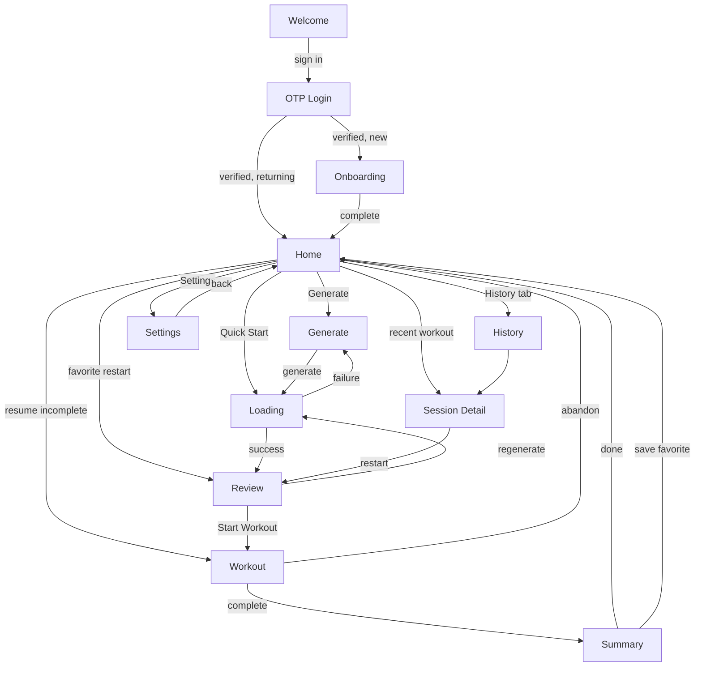

# Information Architecture

> **Status:** DRAFT — for review
> **Purpose:** the missing layer between *what a screen does* (requirements) and *what components exist* (design system). This says **which components compose which screen, in what states, reached from where.**
> **Consumers:** whoever builds a UI requirement. Read the screen entry before writing markup.
> **Companion:** `specs/design/ATOMIC.md` — gated on the Claude Design export — will specify each component's variants, states, and token bindings. This document names the vocabulary; that one defines it.

---

## Why this exists

The requirements specify **behavior** and the design system specifies **components**, but nothing said which components assemble into which screen. An agent handed EXE-03 knew what a circuit renderer must *do* and had a component library to build from — and would have invented an arrangement. Twenty UI requirements, twenty inventions, and a design system that rots on contact.

This document closes that gap. Every screen entry is a build contract: route, guard, entry points, exits, the four CORE-04 states, its component tree, and the requirements that own it.

**The rule it enforces:** if a screen needs something not in the vocabulary below, that is a **new component requirement in the DS trunk** — not an inline one-off. Adding to the vocabulary is a deliberate act with a ticket attached.

---

## 1. Route map

| Route | Guard | Screen | Purpose | Requirements |
|---|---|---|---|---|
| `/welcome` | public-only | Welcome | Entry for signed-out visitors | AUTH-02 |
| `/login` | public-only | OTP Login | Email code request + verify | AUTH-02 |
| `/onboarding` | authed, not onboarded | Onboarding | First-run profile setup | ONB-01 |
| `/` | protected | Home | Daily entry point | HOME-01, HOME-02, HOME-03 |
| `/generate` | protected | Generate | Configure a workout | GEN-04, OVR-04 |
| `/review` | protected + workout in state | Review | Pre-workout briefing, swaps | REV-01, REV-03, OVR-01 |
| `/workout` | protected + active session | Workout | Execution | EXE-01…05, OVR-03 |
| `/summary` | protected + completed session | Summary | Debrief | SUM-01, FAV-01 |
| `/history` | protected | History | Past workouts + favorites | HIST-01, FAV-01 |
| `/history/:id` | protected | Session Detail | One workout, fully expanded | HIST-01 |
| `/settings` | protected | Settings | Hub + 4 sub-views | SET-01, SET-02 |
| `/dev/gallery` | dev only | Component Gallery | Every component, every state | DS-07 |
| `*` | — | Not Found | Fallback | ENV-01 |

**Guard semantics (AUTH-03).** `public-only` redirects authenticated users away. `protected` redirects unauthenticated users to `/welcome`. The onboarding gate redirects authenticated-but-not-onboarded users to `/onboarding` from any protected route. A failed profile fetch renders an **error state** — never the onboarding gate. That distinction is defect D1 and it is a guard-level rule, not a screen-level one.

**State-dependent guards.** `/review`, `/workout`, and `/summary` require session state, not just auth. Landing on `/workout` with no active session redirects Home rather than rendering an empty shell.

---

## 2. Navigation graph



**The loop that matters** is Home → Generate → Loading → Review → Workout → Summary → Home. Everything else is a branch off it. M1's gate is exactly this loop working end to end on a phone.

**Three ways into Review**, and they matter for REV-01's state handling: fresh generation (from Loading), regeneration (discards the previous workout, confirm first), and favorite restart (a stored snapshot, no generation call at all).

---

## 3. Component vocabulary

Four layers. A screen composes from these; anything missing is a new DS requirement.

### Layer 1 — Primitives (DS-03, DS-04)
`ChamferedFrame` · `Card` · `CTAButton` · `ActionButton` · `Input` · `Textarea` · `Checkbox` · `RadioButton` · `IntensitySlider` · `Chip` · `FilterDropdown` · `FilterToggle`

### Layer 2 — Layout (DS-03)
`AppLayout` · `AuthLayout` · `OnboardingLayout` · `WorkoutLayout` · `PageHeader` · `TabbedPanel`

### Layer 3 — Feedback & status (DS-05)
`ErrorState` · `EmptyState` · `LoadingSkeleton` · `LoadingScreen` · `FullscreenLoader` · `ConfirmationModal` · `BottomSheet` · `ChamferedToast`

Every one of these is a CORE-04 obligation. A screen that can render nothing is incomplete.

### Layer 4 — Domain components
**Display:** `WorkoutListItem` · `FavoriteListItem` · `WeekStreakDisplay` · `MoodIcon` · `StructureResultBadge` · `WorkoutOverview` · `WorkoutSectionCard` · `ProgressTracker` · `TimerDisplay`

**Execution (the deepest tree in the app):**
```
SectionRenderer          ← dispatches on structure_type
├── ActiveExerciseCard   ← standard; set logging, cues, notes
├── SupersetRenderer     ← A/B pairing, rest after both
├── CircuitRenderer      ← rounds × movements
├── LadderRenderer       ← ladder rep schemes
│   └── LadderRungs      ← rung selector; read-only vs interactive
└── TimedRenderer        ← EMOM / AMRAP / For Time
    ├── SectionTimer
    └── LadderRungs
RestTimerBar · GlobalTimer · WorkoutNavigation · ExerciseNotes
```

**This tree is the rebuild's central architectural bet.** The old app collapsed most of it into one 652-line component handling six structure types and seven rep schemes. Splitting the dispatch (`SectionRenderer`) from the renderers is what makes EXE-02, EXE-03, and EXE-04 three independent, parallel tickets instead of three edits to one file.

**Decorative:** `ClearLogo` · `CornerAngle` · `ScanLoader` · `AnimatedBackground` — all DS-06, all opt-in.

---

## 4. Screens

Each entry is a build contract. **States** are the CORE-04 four; where a state is marked *n/a* the reason is given.

### Welcome — `/welcome`
**Guard:** public-only · **Requirements:** AUTH-02
**In:** cold open, sign-out · **Out:** `/login`
**Composition:** `AuthLayout` › `ClearLogo` + `CTAButton`
**States:** populated only — static screen, no data fetch.

### OTP Login — `/login`
**Guard:** public-only · **Requirements:** AUTH-02
**In:** Welcome · **Out:** `/onboarding` (new) or `/` (returning)
**Composition:** `AuthLayout` › `PageHeader` + `Card` › `Input` + `CTAButton`
**States:** loading (verifying) · error (wrong/expired code — typed, never a raw Supabase string) · populated. **Empty:** n/a.
**Interactions:** request code · enter code · resend with cooldown countdown.

### Onboarding — `/onboarding`
**Guard:** authed + not onboarded · **Requirements:** ONB-01 · **Spec:** `specs/screens/onboarding-wireframe.md`
**In:** first verified login · **Out:** `/` on atomic commit
**Composition:** `OnboardingLayout` › `PageHeader` + `Card` › `RadioButton` · `Chip` · `Textarea` · `CTAButton`
**States:** loading (committing) · error (commit failed — no partial profile) · populated. **Empty:** n/a.
**Interactions:** step forward/back preserving entries · experience · goal · location + equipment · sections · limitations.

### Home — `/` ★
**Guard:** protected · **Requirements:** HOME-01, HOME-02, HOME-03
**In:** login, onboarding, any screen's back/done · **Out:** everywhere
**Composition:** `AppLayout` › `PageHeader` + `WeekStreakDisplay` + `Card`(×2 quick actions) + `TabbedPanel` › `WorkoutListItem` · `FavoriteListItem` + `ConfirmationModal`
**States:** **all four, and this is the screen where it matters most.** Loading skeleton on first paint · empty (no history yet — distinct from loading) · error (history fetch failed, retry) · populated.
**Interactions:** Generate · Quick Start (reuses last config, skips `/generate`) · resume incomplete session · mark rest day · switch History/Favorites tab · open a workout · accept or dismiss a deload suggestion (OVR-04).

### Generate — `/generate`
**Guard:** protected · **Requirements:** GEN-04, OVR-04
**In:** Home · **Out:** Loading → Review
**Composition:** `AppLayout` › `PageHeader` + `Card` › goal selector · `IntensitySlider` · anchor selector · `LocationAccordion` · `OptionalFields` (`Input`, `Textarea`) + `CTAButton`
**States:** loading (profile defaults) · error (profile unavailable) · populated. **Empty:** n/a.
**Interactions:** select goal → **clamps the intensity range** · select anchor · override location · time target · notes · generate. Deload banner above the intensity selector when triggered.

### Loading — transient, no route
**Requirements:** GEN-05 · **Spec:** `specs/screens/loading-screens.md`
**Composition:** `FullscreenLoader` › `ScanLoader` + staged status copy + cancel
**States:** loading is the whole screen. Cancel returns to Generate; stale results are discarded after unmount.

### Review — `/review` ★
**Guard:** protected + workout in state · **Requirements:** REV-01, REV-03, OVR-01
**In:** Loading (fresh) · Review (regenerate) · Home/History (favorite restart) · **Out:** `/workout`, or back to Loading
**Composition:** `AppLayout` › `PageHeader` + `WorkoutOverview` + `WorkoutSectionCard`(×n) › exercise rows + swap affordance + `CTAButton` + `ConfirmationModal`
**States:** loading (favorite snapshot hydrating) · error (swap failed — **content never silently changes**) · populated. **Empty:** n/a — a workout with no sections is a validation failure, not an empty state.
**Interactions:** expand section · swap one exercise · swap a whole block · undo swap (3 per slot) · regenerate-nudge after the third · start · regenerate with confirm. With OVR-01: per-exercise weight suggestion, confidence, and a "why this number" sheet.

### Workout — `/workout` ★★
**Guard:** protected + active session · **Requirements:** EXE-01…05, OVR-03 · **Specs:** `specs/structures/*`
**In:** Review, Home (resume) · **Out:** `/summary`, or abandon → Home
**Composition:**
```
WorkoutLayout
├── PageHeader + GlobalTimer
├── ProgressTracker
├── SectionRenderer → one of: ActiveExerciseCard | SupersetRenderer
│                            | CircuitRenderer | LadderRenderer | TimedRenderer
├── RestTimerBar
└── WorkoutNavigation
```
**States:** loading (session hydrating) · error (persist failed — **logged sets must never be silently lost**) · populated. **Empty:** n/a.
**Interactions:** log a set (weight/reps/RPE) · mark warmup set · expand cues · view regression · exercise notes · start/skip/extend rest · advance round or minute · select ladder rung on cap · capture AMRAP partial reps · section RPE at completion (OVR-03) · prev/next section · abandon with confirm.
**This screen carries the most interaction surface in the app and is why the rebuild exists.**

### Summary — `/summary`
**Guard:** protected + completed session · **Requirements:** SUM-01, FAV-01
**In:** Workout completion · **Out:** Home
**Composition:** `AppLayout` › `PageHeader` + `Card` › `MoodIcon`(×5) + `Textarea` + `WeekStreakDisplay` + `CTAButton`(×2)
**States:** loading (writing) · error (save failed, retry) · populated. **Empty:** n/a.
**Interactions:** mood 1–5 · session notes · save as favorite · done.

### History — `/history`
**Guard:** protected · **Requirements:** HIST-01, FAV-01
**In:** Home · **Out:** `/history/:id`, `/review` (favorite restart)
**Composition:** `AppLayout` › `PageHeader` + `TabbedPanel` › `FilterDropdown` · `FilterToggle` + `WorkoutListItem` · `FavoriteListItem` + `EmptyState`
**States:** all four. Empty splits two ways — *no workouts yet* and *no results for these filters* — and they need different copy.
**Interactions:** switch tab · filter by anchor/goal/intensity · open detail · restart favorite · unfavorite.

### Session Detail — `/history/:id`
**Guard:** protected · **Requirements:** HIST-01
**In:** History, Home recents · **Out:** back, or `/review` (restart)
**Composition:** `AppLayout` › `PageHeader` + `Card` › section blocks › logged sets + `StructureResultBadge` + `MoodIcon`
**States:** loading · error (not found / not yours — RLS) · populated. **Empty:** n/a — a session always has content.
**Interactions:** expand section · view logged sets · view structure result · restart · save as favorite.

### Settings — `/settings` (+ 4 sub-views)
**Guard:** protected · **Requirements:** SET-01, SET-02
**In:** Home · **Out:** Home, sub-views
**Composition:** `AppLayout` › `PageHeader` + `Card` rows → `SettingsHub` | `LocationSettings` | `StructureSettings` | `LimitationsSettings`
**States:** loading · error (save failed — **optimistic update rolls back**) · populated. **Empty:** locations can be empty; every other view always has content.
**Interactions:** goal preset · enabled sections · limitations · theme selection (**several themes — DS-01 gated**) · location CRUD · equipment tier · set default · sign out.

### Component Gallery — `/dev/gallery`
**Guard:** dev only · **Requirements:** DS-07
Every component in every state, live theme switching. Excluded from production bundles. **This is the visual review surface** — screens get approved rendered, not drawn.

### Not Found — `*`
**Requirements:** ENV-01 · `AppLayout` › `EmptyState` + `CTAButton` home.

---

## 5. Cross-cutting

**Error boundary (CORE-04).** Wraps the router. A render crash produces a recoverable screen, never a white page.

**Offline / connection loss.** Not handled in M0–M2. Generation and persistence fail through the normal typed-error path. Real offline is OFF-01 (M3, needs spec).

**Deep links.** Every route is directly linkable; SPA rewrites make refresh safe (ENV-03). State-dependent routes redirect Home rather than rendering empty.

**Back button.** Browser back works everywhere. From `/workout` it triggers the abandon confirm rather than silently discarding the session.

**Theme.** Selection persists per user (SET-01) and applies globally. Theme *count* comes from the design export — nothing may hardcode a theme list.

---

## 6. Open questions

1. **Quick Start with no history** — nothing to reuse. Fall back to profile defaults, or hide the action until one workout exists?
2. **Mid-workout navigation away** (History from Workout) — currently impossible. Deliberate, or a gap?
3. **Session Detail from a favorite restart** — the restarted session is new; does the favorite's completion history link back to each session, and is that surfaced anywhere in M2?
4. **Rest-day marking from anywhere**, or only Home?
5. **Onboarding re-entry** — can a user re-run onboarding from Settings, or is it strictly first-run?
